# Referencearkitektur for observation og måling

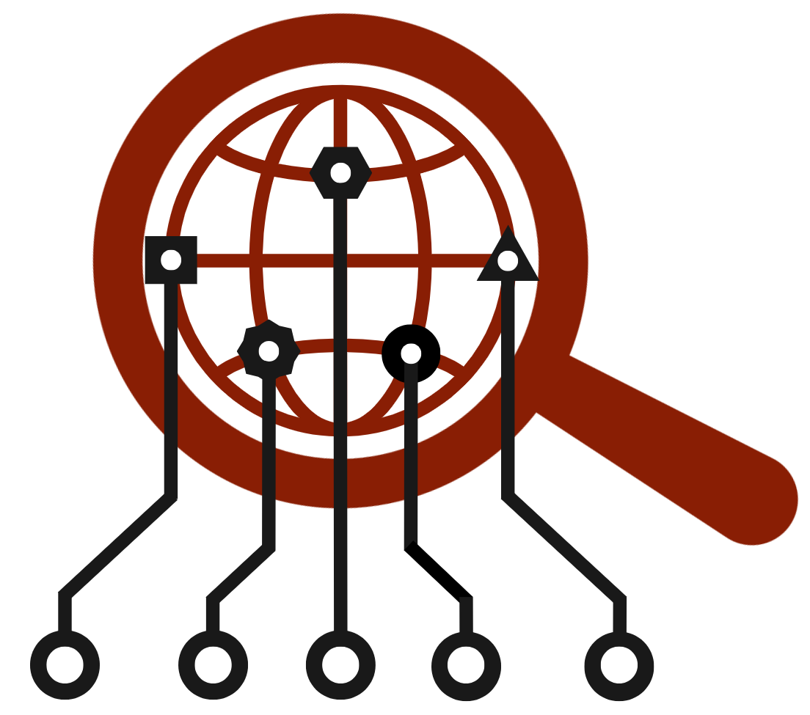

## Introduktion

### Formål

Formålet med denne fællesoffentlige referencearkitektur er at opstille fælles arkitekturrammer og et fælles sprog for, hvordan myndigheder og andre aktører på tværs af den offentlige sektor kan arbejde ensartet med at frembringe værdifulde og pålidelige data om alt det, som dagligt observeres og måles vedrørende eksempelvis borgere, patienter, naturen, miljøet osv. I denne referencearkitektur vil denne særlige type af data blive refereret til som observerbare og målbare data.

Disse observerbare og målbare data kan fx være resultaterne, som dokumenteres på baggrund af en patientundersøgelse på et hospital eller de målinger, som en IOT-sensor indsamler omkring forureningsniveauet i en tæt trafikeret bydel.

Observerbare og målbare data udgør viden om, hvordan specifikke forhold tager sig ud på bestemte tidspunkter og er en grundlæggende forudsætning for, at de fleste offentlige myndigheder kan yde den rette service på baggrund af et oplyst datagrundlag. Referencearkitekturens mål, at det skal være nemmere at udveksle og sammenstille disse observerbare og målbare data uanset, hvilken aktør og it-løsning, data er indsamlet og dokumenteret i. Dette kan være med til at sikre bedre sammenhæng mellem myndigheder og aktører på tværs af den offentlige sektor. Det kan i sidste ende komme borgere, virksomheder, naturen, klimaet og andet til gode i Danmark.

Referencearkitekturen er et middel til at opnå datastandardisering på tværs af den offentlige sektor, ved bl.a. at hjælpe med at belyse fælles indsatsområder, hvor fælles standarder og evt. løsningskomponenter kan bidrage med at dele og stille observerbare og målbare data til rådighed indenfor eller på tværs af forretningsområder.

Referencearkitekturen kan anvendes af alle, så længe omdrejningspunktet er at arbejde systematisk, struktureret og ensartet med de forhold, som observeres og måles for at skabe gode data af høj kvalitet.

Ved i ibrugtagning af referencearkitekturen er det op til det enkelte forretningsområde, projekt mfl. at udvælge og prioritere de dele af referencearkitekturen, som giver mening ift. til den konkrete anvendelsessituation og problemstilling. Referencearkitekturen behøver derfor ikke følges til punkt og prikke, men skal mere ses som et værktøj til at opnå bedre og mere pålidelige data, som kan anvendes af flere parter.

### Scope/afgrænsning

Referencearkitekturen definerer en række begreber, regler og logiske modelkomponenter til at beskrive, dokumentere, strukturere og udveksle data om observationer og målinger i it-løsninger. Den giver en ramme for indsamling, dokumentation, udveksling og anvendelse af data der er baseret på observationer og målinger af den fysiske verden.

Referencearkitekturens scope er afgrænset til at omhandle ovenstående, men der findes en lang række internationale standarder og specifikationer inden for emneområdet, som denne referencearkitektur er udviklet på baggrund af, som hver især kan bidrage med yderligere detaljegrad og tilføjelser inden for emnet. I afsnittet [tilblivelse](#tilblivelse) kan der læses mere om de bagvedliggende standarder og specifikationer, samt findes links til relevante hjemmesider hvor de er beskrevet.

Referencearkitekturen skal ikke anses som en teknisk byggeanvisning der konkret redegør for, hvordan man bygger it-løsninger. Referencearkitekturen og referencearkitekturens anvendelsesmodel kan dog have indflydelse på, hvordan en løsning kan designes.

### Målgruppe

Denne referencearkitektur skal understøtte fællesoffentlige digitaliseringsprojekter og datainitiativer både på tværs af den offentlige forvaltning og i det private. Referencearkitekturen kan være relevant for alle parter som arbejder med it-løsninger der omhandler observation og måling, og derfor bør disse parter forholde sig til referencearkitekturen, med hensyntagen til eksisterende domænespecifikke krav, standarder og begrænsninger indenfor det pågældende domæneområde.

Referencearkitekturen er på forskellig vis relevant for nedenstående målgrupper:

* Den primære målgruppe: **Forretnings- og it-arkitekter** (løsningsarkitekter) tilknyttet offentlige digitaliseringsprojekter, der har til opgave at standardisere data samt kravspecificere og designe løsninger, bør orientere sig i hele dokumentet.
* Den sekundære målgruppe: **Udviklere og leverandører** af offentlige it-løsninger, som har til opgave at designe og udvikle it-løsninger. Disse kan med fordel orientere sig i dokumentet som helhed, men særligt kapitlerne information, applikation og infrastruktur som handler om hvordan referencearkitekturen kan realiseres.
* Herudover: **Projektledere og beslutningstagere,** herunder de med rollen som systemejer. Disse kan med fordel læse de første dele af dokumentet: Strategi, Styring, Jura og Opgaver.

### Anvendelse og værdiskabelse

Referencearkitektur skal hjælpe løsningsprojekter med at understøtte fælles, tværgående forretningsmål. Desuden definerer referencearkitekturen fælles **mål** (læs mere om dette i afsnittet [Strategi](#strategi)), **begreber** (læs mere om dette i afsnittet [Information](#information)) samt en række anvendelsesscenarier for implementering af komponenter som bl.a. kan understøtte ensartet indsamling af observations- og måledata

På et mere konkret plan er det tiltænkt, at referencearkitekturen kan anvendes som vejledning og referenceramme i forhold til arbejdet med at designe løsningsarkitekturer samt domænespecifikke referencearkitekturer, datastandarder, klassifikationer mfl.

Overordnet skal referencearkitekturen være et middel eller værktøj, som kan anvendes i nuværende eller til fremtidige it-løsninger, der har til formål at understøtte et eller flere af følgende forretningsbehov:

* _Behov for **standardisering** og **klassificering**af data_
* _Behov for **opsamling** og **registrering** af observerbare- og målbare data i it-løsninger_
* _Behov for fælles **dokumentationsramme** i forhold til at opsamle og registrere data ensartet og i en høj kvalitet_
* _Behov for at **sammenstille** og **sammenligne** data for at opnå nye indsigter_
* _Behov for at **transformere** data fra flere kilder til et **fælles format**_
* _Behov for at **overvåge** og_ **følge _udviklingen_** _af konkrete forhold over tid_
* _Behov for et **veldokumenteret** og **oplyst**_ beslutningsgrundlag
* _Behov for at kunne **dele** og **forstå** data mellem to eller flere parter, herunder udveksle data på tværs af myndigheder, organisationer og it-løsninger_

Nedenstående afsnit redegør for forskellige scenarier hvor referencearkitekturen kan komme i brug, understøttet af en række eksempler som på et helt overordnet niveau, kort redegør for, hvordan referencearkitekturen kan anvendes. Læs mere om referencearkitekturens opgaveunderstøttelse i afsnittet [Opgaver](#opgaver).

#### Udarbejdelse af faglige klassifikationer om observerbare- og målbare forhold

Referencearkitekturen kan anvendes som et akademisk værktøj/metode til begrebsarbejde, standardisering og klassificering af observations- og måledata. Herunder at definere, beskrive og strukturere observerbare egenskaber, udfaldsrum, måleenheder og metoder indenfor et fagområde eller på tværs af fagområder. Fagfolk og akademisk personale inden for et specifikt fagområde kan bruge referencearkitekturens semantiske regler og rammer til ensartet at beskrive og strukturere de begreber, de data der kan observeres og måles inden for et fagområde/forretningsområde. Udarbejdede klassifikationer kan efterfølgende anvendes i it-løsninger, sensorer, måleapparater mfl. til at understøtte ensartet indsamling, dokumentation og udveksling af observations- og måledata. Læs mere om dette i afsnittet [Centrale begreber og overordnet koncept](#begreberkoncept) og afsnittet [Opgaver](#opgaver) samt afsnittet [Information](#information)

#### Udvikling og anskaffelse af IT-løsninger og klassifikationskomponenter til observation og måling

Referencearkitekturen kan fungere som en vejledning til udvikling af it-løsninger samt anvendes til anskaffelse (krav til overholdelse af hele eller dele af referencearkitekturen) af IT-løsninger, der indsamler, behandler, udveksler og præsenterer observerbare og målbare data (herunder systemer, apparater mfl.). Ved at følge de standarder og retningslinjer, der er fastlagt i referencearkitekturen, kan man dels opbygge eller anskaffe it-løsninger som registrerer og dokumenterer observations- og måledata på en ensartet måde. Og it-løsninger som er opbygget komponentbaseret med selvstændige eller delte klassifikationskomponenter, der gør it-løsningerne fleksible og robuste ift. forandringer inden for de pågældende anvendelsesområder.

Referencearkitekturen kan anvendes til at udvikle et egenskabskatalog (klassifikationskomponent), hvor brugere kan oprette, beskrive og vedligeholde klassifikationer over observerbare egenskaber, udfaldsrum, måleenheder og metoder som IT-løsninger og andre kan tilgå og hente klassifikationer fra. Anvendelse af klassifikationer i it-løsninger, sensorer, måleapparater mfl. kan bidrage til standardiserede data, som er dokumenteret ensartet og af samme kvalitet. Udviklingen af en klassifikationskomponent kan ske indenfor et projekt/fagområde eller som et samarbejde mellem flere projekter/fagområder, som ønsker at dele klassifikationer om observerbare og målbare data. Læs mere om dette i afsnittet [Centrale begreber og overordnet koncept](#begreberkoncept), afsnittet [Information](#information) og afsnittet [Applikation](#applikation)

#### Fælles udvekslingsstandard mellem it-løsninger

Referencearkitekturen kan bruges til at etablere standardiserede formater og protokoller til udveksling af observerbare og målbare data mellem forskellige it-løsninger, herunder sensorer, måleapparater mfl. Dette sikrer en ensartet og pålidelig udveksling af data, hvilket kan bidrage til bedre samarbejde, koordination og muligheder for sammenstilling af data på tværs af den offentlige sektor og private sektor. Læs mere om referencearkitekturens logiske datamodel som kan danne grundlag for standardiserede udvekslingsformater og protokoller om observations- og måledata i følgende afsnit [Information](#information)

#### Eksempler på anvendelse

##### Standardisering som grundlag for ensartet dokumentation af observerbare og målbare data på ustrukturerede fagområder.

Referencearkitekturen kan anvendes som et middel til at klassificere og standardisere data på fagområder, som i høj grad er præget af ustrukturerede data såsom eksempelvis socialområdet. Ved at nedbryde og få styr på de forskellige begreber, som relaterer sig til de forhold, som man ønsker at opnå viden om (observere og måle på), kan man opnå en ensartet dokumentationsramme, som kan implementeres og anvendes i en eller flere it-løsninger. Dokumentationsrammen kan være med til at sikre, at data dokumenteres ensartet og struktureret.

[Fællessprog III](https://www.kl.dk/kommunale-opgaver/sundhed-og-aeldre/data-dokumentation-og-digitalisering/faelles-sprog-iii/) er et godt eksempel på, hvordan man på et begrænset "område" indenfor det kommunale sundheds- og ældreområde, har skabt en fælles standard og klassifikationer om de data, som bliver indsamlet om borgerens helbredstilstande og funktionsevner i omsorgsjournalsystemer på tværs af kommunerne. Klassifikationerne i Fællessprog III bidrager til at data om borgerens tilstand indsamles ensartet og struktureret hver gang.

Referencearkitekturen kan, på samme måde som arbejdet i FSIII, netop bidrage med rammer og et fælles sprog til at opbygge standarder og klassifikationer, som kan være med til at sikre at data som opsamles via observation og måling bliver ensartet struktureret og dokumenteret i it-løsninger.

##### Sammenstille data fra IOT-sensorer om luftforurening i Danmark

Referencearkitekturen kan anvendes som et fælles udvekslingssprog mellem flere parter og deres it-løsninger. Det kunne f.eks. tænkes, at der af politiske, klima- og sundhedsmæssige grunde ønskes et overblik over luftforureningen i Danmark. Der er opsat en lang række IOT-sensorer på tværs af Danmark, som opsamler data om trafikforurening, luftkvalitet og andre miljø- og klimaforhold, og som kan anvendes til få indsigt i luftforureningen rundt om i Danmark.

Sensorerne som er opsat, er fra forskellige producenter og indsamler derfor ikke data ensartet efter samme standarder. Data ligger desuden i en lang række forskellige it-løsninger på tværs af myndigheder og organisationer, og er derfor dokumenteret og struktureret på forskellig vis. Her kan referencearkitekturen anvendes til at udvikle en fælles udvekslingsstandard, som skaber et fælles sprog ift. til de data, som er relevante at udveksle og sammenstille for at kunne få overblik overluftforureningen i Danmark.

Desuden vil der også kunne udvikles fælles standarder på baggrund af referencearkitekturen, som enten kan direkte implementeres i sensorerne, så de opsamler data efter den fælles standard, eller som en fælles standard der implementeres som udvekslingssprog mellem sensorerne og de it-løsninger som dokumenterer resultaterne, sådan at data dokumenteres i løsningerne efter fælles rammer.

### Læsevejledning

Kapitel 1 til 8 i dette dokument er struktureret efter de otte arkitekturperspektiver om **styring**, **strategi**, **jura**, **sikkerhed**, **opgaver**, **information**, **applikation** og **infrastruktur**, jf. [FDA-retningslinjer for formidling og dokumentation](https://arkitektur.digst.dk/metoder/arkitekturmetoder/introduktion-til-retningslinjer-formidling-og-dokumentation-af-arkitektur). Formålet med retningslinjerne er at give et fælles sprog for dokumentation af data og arkitekturen i digitaliseringsprojekter. Retningslinjerne skal medvirke til at højne kvaliteten i offentlige digitaliseringsprojekter og understøtte sammenhængende digitalisering og bedre datadeling.

De enkelte kapitler er ikke udfoldet i samme detaljeniveau. I denne referencearkitektur er der lagt særlig vægt på kapitlet "information", som rummer kernestoffet for denne referencearkitektur, mens behandlingen i de øvrige kapitler er mere overordnet.

* **0\. Introduktion:** Dette kapitel henvender sig til alle læsere. Det omfatter en generel introduktion til referencearkitekturens formål, scope, anvendelse og tilblivelse, samt en kort introducerende kernefortælling om observerbare og målbare data, samt en kort forklaring af de centrale begreber som bliver anvendt igennem dokumentet.

De følgende kapitler henvender sig til læsere med interesse for de enkelte arkitekturperspektiver. Alle læsere bør læse kapitlerne **Styring** og **Strategi** for at få en uddybende forståelse af formål og konteksten for referencearkitekturen.

Særligt kapitlet **Information** henvender sig til forretningsarkitekter med viden om den forretningsmæssige arkitektur, mens kapitlerne **Applikation** og **Infrastruktur** henvender sig til læsere med interesse for realisering af referencearkitekturen i konkrete løsninger.

* **1\. Styring:** Dette kapitel beskriver overordnet de mest centrale interessenters interesse i referencearkitekturen, og de styringsmæssige rammer omkring referencearkitekturen. Herunder redegør kapitlet for de overordnede fællesoffentlige forretningsmål, som referencearkitekturen understøtter, bl.a. understøttelsen af de fællesoffentlige arkitekturprincipper og-regler.
* **2\. Strategi:** Dette kapitel beskriver visionen og de overordnede mål for referencearkitekturen, og belyser den nuværende as-is situation og ønskede to-be situation.
* **3\. Jura:** Dette kapitel beskriver meget kort nogle de juridiske bindinger, der skal tages højde for i arbejdet med observerbare og målbare data.
* **4\. Sikkerhed:** Dette kapitel omhandler meget kort nogle af de sikkerhedshensyn der skal tages højde for i arbejdet med observerbare og målbare data.
* **5\. Opgaver:** Dette kapitel beskriver seks overordnede procestrin for indsamling, håndtering og anvendelse af observerbare og målbare data
* **6\. Information:** Dette kapitel indeholder en overordnet begrebsmodel som redegør for de mest centrale begreber ift. at arbejde ensartet og struktureret med observerbare og målbare data. Herudover indeholder dette kapitel udsnit af referencearkitekturens anvendelsesmodel, hvor de vigtigste informationselementer i anvendelsesmodellen bliver beskrevet og forklaret. Anvendelsesmodellen er fuldt beskrevet i et selvstændigt dokument.
* **7\. Applikation** redegør for de tekniske forhold, som gør sig gældende ved anvendelse og implementering af referencearkitekturens anvendelsesmodel. Kapitlet henvender sig især til dem, som skal bygge eller anskaffe it-løsninger som lever op til referencearkitekturen i konkrete projekter.
* **8\. Infrastruktur** nævner kort de krav, en infrastruktur skal leve op til.

### Centrale begreber og overordnet koncept

Dette afsnit giver en introduktion til referencearkitekturens centrale begreber og det overordnede koncept.

#### Centrale begreber

**Tabel 1** indeholder en beskrivelse af de begreber, der er centrale for læseren for at forstå referencearkitekturens kernefortælling og den terminologi, som anvendes igennem dokumentet og i referencearkitekturens anvendelsesmodel.

|                                                                                    |                                                                                                                                                                                                                                                                                                                                                                                                                                                                                                                                                                                                                                                               |
| ---------------------------------------------------------------------------------- | ------------------------------------------------------------------------------------------------------------------------------------------------------------------------------------------------------------------------------------------------------------------------------------------------------------------------------------------------------------------------------------------------------------------------------------------------------------------------------------------------------------------------------------------------------------------------------------------------------------------------------------------------------------- |
| **Centrale begreber**                                                              | **Kort beskrivelse**                                                                                                                                                                                                                                                                                                                                                                                                                                                                                                                                                                                                                                          |
| **Observerbare- og målbare data**                                                  | samlet forståelsesbetegnelse for data om specifikke forhold, herunder genstandsfelter og objekter.  Observerbare og målbare data anvendes ofte til at fortælle, hvordan "noget" tager sig ud på et bestemt tidspunkt. Det kan f.eks. være de data, som udgør svaret i en blodprøve. Her tænkes både på selve resultatet i form af forskellige tal og værdier og på den struktur med faglige begreber og termer, som er nødvendige for at forstå og fortolke en blodprøve.  Observerbare og målbare data dækker i denne referencearkitektur over en række forskellige typer af data: Forretnings- og transaktionsdata, Referencedata, og Metadata. |
| **Forretnings- og transaktionsdata**                                               | datasæt med observations- og måledata, dvs. konkrete resultater fra forretningen.                                                                                                                                                                                                                                                                                                                                                                                                                                                                                                                                                                             |
| **Referencedata**                                                                  | datamodeller, anvendelsesprofiler og (egenskabs)klassifikationer som definerer og beskriver observerbare og målbare data indenfor et bestemt område.                                                                                                                                                                                                                                                                                                                                                                                                                                                                                                          |
| **Metadata**                                                                       | information om forretnings-, transaktions- og referencedata (F.eks. om udgiverpart, ansvarspart, emneområde, udgivelsestidspunkt osv. for et datasæt, klassifikation mfl.)                                                                                                                                                                                                                                                                                                                                                                                                                                                                                    |
| **Observerbar egenskab**  (Forkortes ofte som "Egenskab" igennem dokumentet) | de karakteristika, som kan observeres og måles på forskellige forretningsobjekter og dertilhørende forhold.  Det kan fx være egenskaber ved et menneske, et dyr, vejret, en sø. Det særlige ved observerbare egenskaber er, at de af natur er foranderlige, og altså ændrer sig over tid. Vindhastigheden (observerbar egenskab) vil eksempelvis ofte ændre sig når den måles i løbet af en dag, ligesom vægten (observerbar egenskab) på en person også vil ændre sig når den måles igennem en persons livstid.                                                                                                                                        |
| **Observationsobjekt**  (Forkortes ofte som "objekt" igennem dokumentet)     | det forretningsobjekt/genstandsfelt som er i fokus, og som der fremfindes viden om.  Dette kan fx være en patient, som undersøges på hospitalet eller et sted ude i naturen, som undersøges for miljøforurening.                                                                                                                                                                                                                                                                                                                                                                                                                                        |
| **Observation**  (Synonym: måling, mfl.)                                     | en aktiv handling, som har til formål at fremfinde viden om "noget".  Optræder i denne referencearkitektur som overordnet begreb for en lang række af beslægtede begreber. Det er ofte meget forskelligt, hvilke begreber, som anvendes på forskellige fagområder til netop at redegøre for denne handling der fremfinder resultater om noget. Det kan fx være en undersøgelse, kontrol, indsigt, måling, prøvetagning, opsamling, mfl., men de har alle det til sammen at de giver et resultat om konkrete forhold på bestemte tidspunkter.                                                                                                            |
| **Resultat**                                                                       | de konkrete data i form af værdier, som fremfindes om specifikke forhold og observationsobjekter.  Et observationsresultat er en slags forretnings- eller transaktionsdata.  Det er altså selve dataværdien som registreres i form af et tal, bogstav, ord, sætning mfl. Fx kan det være tallet "80", bogstavet "A", ordet "god", sætningen "Ingen konkrete uoverensstemmelser". Et resultat giver ikke meget mening i sig selv, men mening bliver tydelig så snart det kobles til en veldefineret og beskrevet observerbar egenskab med dertilhørende måleenhed.                                                                                 |
| **Egenskabsklassifikation**                                                        | en ordnet samling af observerbare og målbare egenskaber, som tilsammen er relevante for et bestemt emneområde.  En egenskabsklassifikation anvendes som fælles referencedata. Et emneområde kan både være inden for et bestemt fagområde eller på tværs af flere fagområder.                                                                                                                                                                                                                                                                                                                                                                            |
| **Egenskabskatalog**                                                               | Et katalog over egenskabsklassifikationer.  Et digitalt katalog kan fx anvendes af flere it-løsninger, så de kan tilgå, anvende og evt. tilføje til fælles egenskabsklassifikationer i én fælles kilde.                                                                                                                                                                                                                                                                                                                                                                                                                                                 |

_Tabel 1 - Liste med centrale begreber i referencearkitekturen samt en kort beskrivelse af hvert begreb._

#### Fælles anvendelsesmodel og sprog for observerbare og målbare data

Referencearkitekturens omdrejningspunkt er en anvendelsesmodel udformet som en logisk datamodel, som beskriver sammenhængen mellem en **observation**, det **resultat** observation frembringer samt det genstandsfelt (**observationsobjekt**) og dertilhørende **observerbare egenskaber**, der indsamles viden omkring.

Sagt på en anden måde, er anvendelsesmodellen med til at skabe et fælles sprog og metode til at beskrive en række centrale forretningsobjekter og de forskellige typer af data som fortæller noget om en observation og måling. F.eks. data om selve observationsaktiviteten, såsom tidspunktet for /observationen og målingen, samt information om det sted observation/målingen blev foretaget. Data om selve **resultatet** af observation/målingen. Information om hvilket **forretningsobjekt og observerbar egenskab** var i fokus for målingen. Oplysninger om den **aktør** som foretog observationen/målingen. Hvilket udstyr (**observationsfacilitet**) blev anvendt til at fremfinde et resultat. Hvilken **metode** blev der anvendt. Samt indenfor hvilket **udfaldsrum** og med hvilken **enhed** et resultat angives.

Se tabel 2 på side 12 for eksempler på data for de forskellige forretningsobjekter.

Anvendelsesmodellen og det fælles sprog skal gerne give forskellige fagområder mulighed for at udarbejde specialiserede forretningsmodeller og klassifikationer til deres egne områder, ved netop at anvende og tage udgangspunkt i anvendelsesmodellens opbygning og sprog.

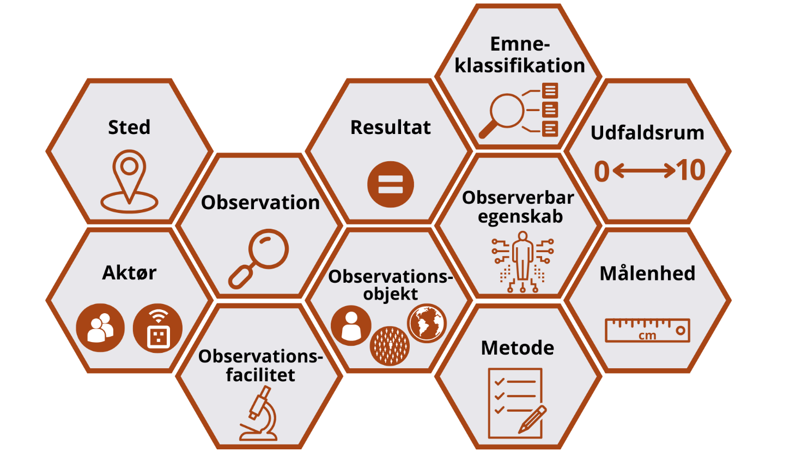

_Figur 1 - Referencearkitekturen og anvendelsesmodellens konceptuelle opbygning_

**Figur 2** er et forsimplet eksempel, som viser og forklarer sammenhængen mellem en række af de centrale begreber i referencearkitekturen (**observation**, **observationsobjekt**, **observerbar egenskab** og **resultat**).

Eksemplet tager udgangspunkt i en patient (**Observationsobjekt**), som går til sin praktiserende læge for at få foretaget en kontrolundersøgelse (**observation**) af sit helbred og diabetes sygdom. Den praktiserende læge identificerer en række forhold (**observerbare egenskaber**) hos patienten, som skal undersøges for at kontrollere, hvordan det går med patientens sygdom. Den praktiserende læge registrerer og dokumenterer resultaterne (**resultat**) af undersøgelsen i patientens journal, hvor resultaterne fra denne undersøgelse og forrige kontrolundersøgelser er struktureret ensartet, så det er nemt at sammenligne resultaterne og følge udviklingen på patientens sygdom. Eksemplet tager udgangspunkt i sundhedsområdet, men kunne lige så godt være beskrevet for et andet fagområde, hvor man fremfinder resultater om forhold om f.eks. naturen, elever, trafik, vejret mfl. Se Tabel 2 i næste afsnit for flere eksempler fra forskellige anvendelsesområder.

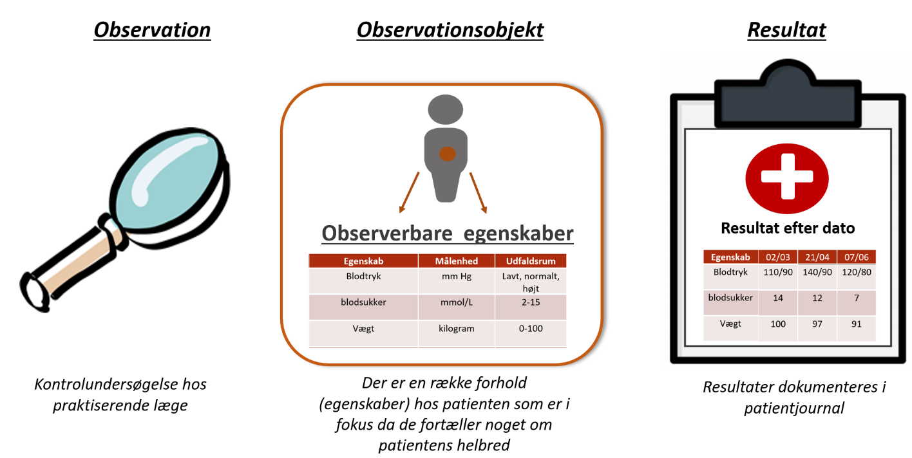

_Figur 2 - Et forsimplet eksempel, som viser og forklarer sammenhængen mellem en række centrale begreber i referencearkitekturen._

#### Ensartet strukturering af observerbare og målbare egenskaber i egenskabsklassifikationer

**Tabel 2** viser hvordan referencearkitekturens anvendelsesmodel kan bidrage til en ensartet måde at opbygge og dokumentere resultater omkring det, der observeres og måles. Her kan det ses, at uanset hvilket område, der observeres og måles på, ser opbygningen og dokumentation af data ens ud. I skemaet kan det ses, at der blandt andet altid er et emne(observationsobjekt), som er i fokus ved en observation/måling. Herudover er der listet en række observerbare egenskaber for hvert emne, hvor det meget præcist defineres, hvilken enhed og udfaldsrum den pågældende egenskab observeres/måles i. Til højre i skemaet kan alle de konkrete resultater ses på forskellige tidspunkter, for at illustrere, hvordan referencearkitekturen kan være med til at sikre, at resultater dokumenteres ensartet over tid. Der kunne ligeledes i skemaet være tilføjet en kolonne, hvor den konkrete målemetode for de forskellige egenskaber angives for at illustrere, hvordan data om målemetoder også kan struktureres, præciseres og beskrives. Herudover kan man yderligere strukturere oplysninger om stedet og tidspunktet, hvor resultatet er fremfundet, hvis dette er relevant på det pågældende område.

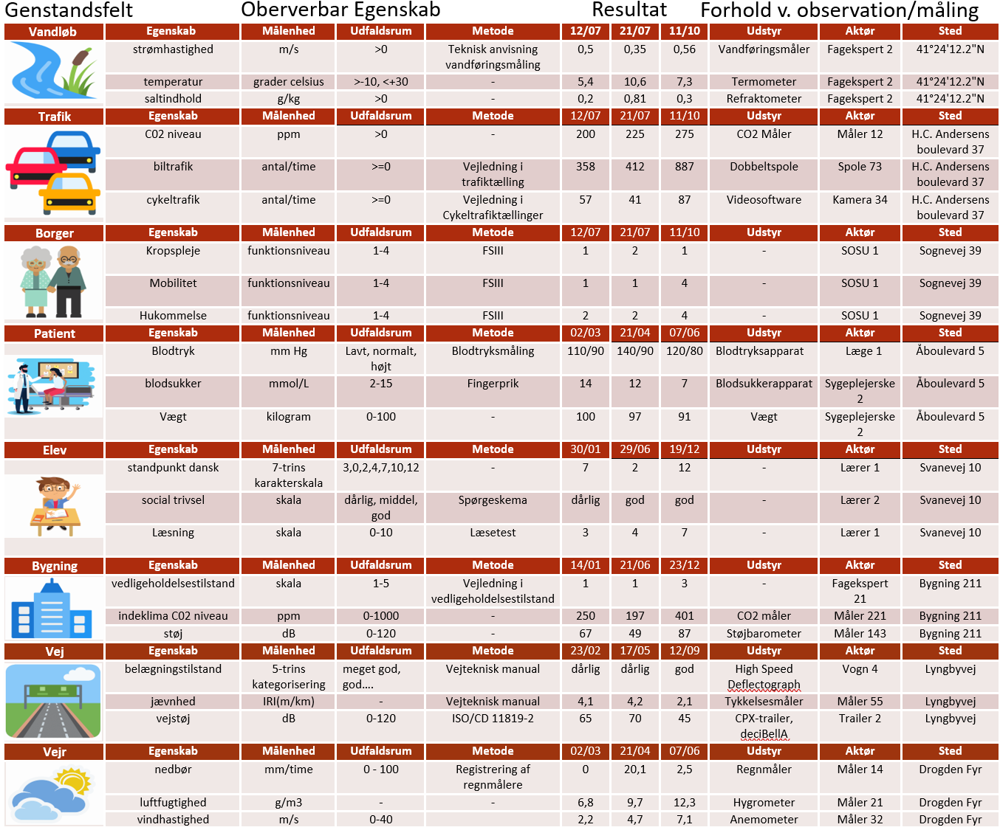

_Tabel 2 - Målbillede for Referencearkitekturen. En fælles måde at opbygge og dokumentere data om resultater om det som observeres og måles_

#### Anvendelse og deling af egenskabsklassifikationer

Referencearkitekturens anvendelsesmodel kan anvendes som en fælles model og metode til at strukturere og udarbejde specialiserede klassifikationer efter. Klassifikationerne kan herefter deles via et centralt eller decentralt katalog, som understøtter, at it-løsninger kan tilgå, berige og anvende klassifikationerne, hvilket kan føre til lettere deling, genbrug og sammenstilling af data på tværs af it-løsninger, fagområder og myndigheder.

**Figur 3** viser, hvordan de enkelte veldefinerede og beskrevne observerbare egenskaber kan struktureres og dokumenteres efter en klassifikation, som indeholder observerbare egenskaber indenfor et defineret emneområde. En sådanne klassifikation kan implementeres direkte i fagsystemer, eller implementeres i et fælles egenskabskatalog, som understøtter at it-løsninger kan tilgå, dele og anvende klassifikationerne. Fx indeholder nedenstående egenskabskatalog en egenskabsklassifikation, som beskriver forhold om patienters helbred.

Det vil være de enkelte fagligheders opgave at udvælge, definere og beskrive relevante observerbare egenskaber indenfor deres fagområde, men så snart egenskaber skal anvendes på tværs af fagligheder, vil det være et fælles ansvar at opnå enighed og styring omkring de observerbare egenskaber.

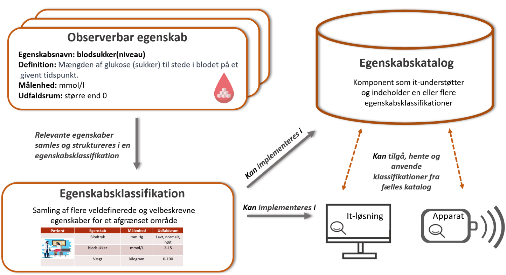

_Figur 3 - Observerbare egenskaber struktureres og dokumenteres efter egenskabsklassifikationer og implementeres i it-løsninger/apparater og eller i et fælles egenskabskatalog som understøtter at flere it-løsninger kan tilgå dem_

### Tilblivelse

Afsættet til denne referencearkitektur er en række internationale specifikationer, ontologier og standarder som vedrører observation og måling. Disse vil kort blive beskrevet i nedenstående afsnit. I referencearkitekturens anvendelsesmodel er der blevet genbrugt relevante centrale forretningsbegreber fra eksisterende internationale og danske specifikationer, ontologier og standarder. De centrale forretningsbegreber er oversat og beskrevet på dansk, så de tager hensyn til danske forhold. Der er angivet kilde på de forretningsbegreber, som er blevet genbrugt, eller som har dannet inspiration for de forretningsbegreber som optræder i referencearkitekturens anvendelsesmodel.

Herudover har KL i samarbejde med Danmarks Miljøportal (DMP) i 2019 udviklet en [Referencearkitektur for Observation og Måling på miljø-, natur-, og klimaområdet](https://rammearkitektur.kl.dk/forretningsviden/referencearkitekturer/referencearkitektur-for-observation-og-maaling/), som anvendes i regi af DMP-projekter i dag.

De gode intentioner fra dette arbejde har bidraget til udviklingen af denne fællesoffentlig referencearkitektur, som kan tages i brug på flere områder på tværs af det offentlige til at arbejde struktureret og ensartet med observerbare og målbare data. Der er ligeledes kigget mod danske forhold, hvor [Den Fælleskommunale rammearkitektur](https://rammearkitektur.kl.dk/) og [Fælles Digitale Arkitektur](https://arkitektur.digst.dk/)(FDA) har bidraget med specifikationer og arkitekturrammer, herunder de [Fællesoffentlige regler for begrebs- og datamodellering](https://arkitektur.digst.dk/metoder/regler-begrebs-og-datamodellering). **Figur 4** viser hvilke "forhold" som har haft indflydelse på udviklingen af denne fællesoffentlige referencearkitektur. Når referencearkitekturen tages i brug indenfor et fagområde, er det vigtigt for det pågældende projekt at orientere sig i eksisterende standarder indenfor det pågældende fagområde.

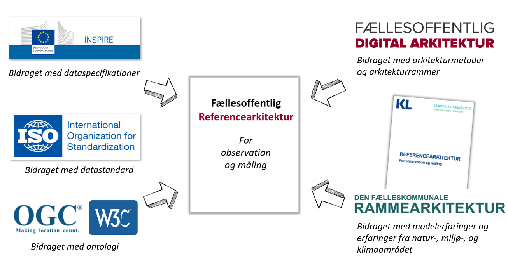

_Figur 4 - Illustration af hvilke materialer, rammer og projekter, som har haft indflydelse på udviklingen af referencearkitekturen for observation og måling._

#### ISO standarden "Observations and Measurements"

[ISO (International Organization for Standardization)](https://www.iso.org/home.html) har udviklet den internationale standard "[ISO 19156:2011 Geographic information - Observations and Measurements](https://www.iso.org/standard/32574.html)".

Standarden handler om standardisering af geografiske observationer og målinger og har til formål at sikre konsistens og interoperabilitet mellem geografiske data og målinger. Standarden er helt central for udviklingen af denne referencearkitektur og dens anvendelsesmodel. Denne ISO-standard har ligeledes været udgangspunktet for udviklingen af nedenstående INSPIRE dataspecifikationen "Environmental Monitoring Facilities" og SOSA/SSN-ontologierne.

#### INSPIRE dataspecifikationen "Environmental Monitoring Facilities"

[INSPIRE-dataspecifikationen D2.8.II/III.7](https://inspire.ec.europa.eu/documents/Data_Specifications/INSPIRE_DataSpecification_EF_v3.0.pdf) "Environmental Monitoring Facilities" handler om standardisering af geografiske data fra miljøovervågningsfaciliteter. INSPIRE står for "Infrastructure for Spatial Information in the European Community" og er en EU-lovgivning, der sigter mod at lette udveksling af geografiske data og fremme anvendelsen af geografisk information til miljøbeskyttelse og -forvaltning. Dataspecifikationen har været inddraget som inspiration ift. udviklingen af referencearkitekturens anvendelsesmodel, særligt ift. til at kunne beskrive det udstyr som kan anvendes til at observerer og måle med.

#### SOSA/SSN-ontologierne

[W3C (World Wide Web Consortium)](https://www.w3.org/) og [OGC (Open Geospatial Consortium](https://www.ogc.org/)) har sammen udviklet et sæt af ontologier til at beskrive sensorer og deres observationer. Sættet af ontologier inkluderer en letvægtsanvendelsesmodel kaldet [SOSA](https://www.w3.org/ns/sosa/) (Sensor, Observation, Sampler og Actuator) og en mere udtryksfuld udvidelsesmodel kaldet [SSN](https://www.w3.org/ns/ssn/) (Semantic Sensor Network).

Sammen udgør SOSA og SSN-ontologierne et semantisk grundlag for at beskrive sensor-netværk og observationer på en standardiseret og interoperabel måde. SOSA/SSN-ontologierne er i stand til at understøtte en bred vifte af applikationer og anvendelsesscenarier som omhandler observation og måling med sensorer. Ved at bruge disse ontologier kan eksempelvis sensor-netværk og IoT-enheder dele og udveksle data på tværs af forskellige systemer og platforme, da ontologierne definerer en fælles forståelse af sensorer, observationer og relaterede koncepter.

### Anvendte metoder og notation

Referencearkitekturen følger den fællesoffentlige digitale arkitekturs metoder og er udarbejdet efter Digitaliseringsstyrelsens retningslinjer for arkitekturdokumentation, herunder anvendelse af skabelon for referencearkitekturer. Referencearkitekturen er generelt udarbejdet, så den er så konsistent som muligt med andre arkitekturdokumenter og standarder udarbejdet i regi af den fællesoffentlige digitale arkitektur. Referencearkitekturen bygger på etablerede fællesoffentlige arkitekturprincipper, aftaler, retningslinjer og metoder vedrørende arkitektur, data og anvendelse af åbne standarder.

Referencearkitekturens anvendelsesmodel er udarbejdet efter de [fællesoffentlige regler for begrebs- og datamodellering](https://arkitektur.digst.dk/metoder/regler-begrebs-og-datamodellering).

## Styring

### Styringsrammer

Der sker styring på flere forskellige niveauer: Internationalt, nationalt, fællesoffentligt, i domæner og lokalt i den enkelte myndighed og projekt. Her er en række eksempler på hvordan forskellige specifikationer og standarder som har relation til denne referencearkitektur bliver styret:

* W3C og OGC har sammen ansvar for standarderne Sensor, Observation, Sampler, Actuator (SOSA) og Semantic Sensor Network Ontology (SSN)
* ISO har ansvar for Geograhic Observation and Measurements
* EU har fx på miljøområdet fastlagt INSPIRE-direktivet
* Nærværende referencearkitektur og anvendelsesmodel er forankret i det fællesoffentlige Udvalg for arkitektur og standarder
* Sundhedsdatastyrelsen har fastlagt en referencearkitektur for opsamling af helbredsdata hos borgeren og en dansk profilering af diagnosestandarden International Statistical Classification of Deseases and Related Health Problems (ICD)

I forhold til anvendelsen af denne referencearkitektur og anvendelsesmodel er anvendelsen frivillig, og ansvaret for anvendelse påhviler det enkelte projekts styregruppe.

Fællesoffentlige projekter er forpligtet til at følge referencearkitekturer og anvendelsesmodel, der er optaget som del af den fællesoffentlige digitale arkitektur (FDA). Disse projekter kan underlægges review og blive forpligtet til at forklare, hvis de ikke følger relevante fællesoffentlige retningslinjer.

For det enkelte projekt der arbejder med observations- og måledata, er der følgende opmærksomhedspunkter:

* Hvis man anvender eksisterende anvendelsesprofiler og egenskabsklassifikationer, bør man sikre sig at de er underlagt en governance, der modsvarer projektets behov, herunder rammer for anvendelse, opdatering og vedligehold mv.
* Hvis man selv definerer en anvendelsesprofil eller egenskabsklassifikation bør man tilsvarende sikre sig via en dialog med de nøgleinteressenter, der forventes at anvende disse specifikationer, at der er enighed om rammer for styring, herunder en organisatorisk forankring og finansiering, samt rammer for anvendelse, opdatering og vedligehold mv., der modsvarer nøgleinteressenternes forretningsbehov.

### Interessenter

De vigtigste interessenter og deres interesse er beskrevet i **Tabel 3** herunder:

|                                                                           |                                                                                                                                                                                                                                                                                                                                                                                                     |
| ------------------------------------------------------------------------- | --------------------------------------------------------------------------------------------------------------------------------------------------------------------------------------------------------------------------------------------------------------------------------------------------------------------------------------------------------------------------------------------------- |
| **Interessent**                                                           | **Interesse**                                                                                                                                                                                                                                                                                                                                                                                       |
| Myndigheder (ministerier, styrelser, regioner, kommuner og andre)         | På tværs af stat, kommuner og regioner er der interesse i fælles dokumentationsramme og -metode i forhold til at opsamle og registrere data ensartet og i en høj kvalitet. Dette for at give bedre mulighed for at sammenstille og sammenligne data samt at kunne dele og forstå data mellem to eller flere parter, herunder udveksle data på tværs af myndigheder, organisationer og it-løsninger. |
| It-leverandører                                                           | Anvende referencearkitekturen ved udvikling og levering af løsninger.                                                                                                                                                                                                                                                                                                                               |
| Standardiseringsorganisationer                                            | Har interesse i opbakning til udvikling og anvendelse af internationale, åbne standarder.                                                                                                                                                                                                                                                                                                           |
| Digitaliseringsstyrelsen, KL, SDFE, Regionerne                            | Definerer overordnede mål og rammer for observation og måling. Involverede i forbindelse med frembringelse af referencearkitekturen.                                                                                                                                                                                                                                                                |
| Fælles udvikling-, udbud- og indkøbsorganisationer, fællesskaber og lign. | Udvikling og anskaffelse af it-løsninger som overholder referencearkitekturens rammer og standarder (krav), hvor det er relevant.                                                                                                                                                                                                                                                                   |
| Erhvervsliv, virksomheder og forskere                                     | Primære interessenter som producerer og anvender observerbare- og målbare data                                                                                                                                                                                                                                                                                                                      |

_Tabel 3 - Centrale interessenter_

### Overordnet formål med referencearkitekturen

Denne referencearkitektur har til formål at understøtte offentlige digitaliseringsprojekter, der har som mål at indsamle og anvende observerbare og målbare data, herunder særligt projekter, hvor der er behov for at dele og sammenstille data fra flere forskellige kilder og anvendelsesområder.

Referencearkitekturen kan understøtte følgende generelle typer af forretningsmål i konkrete projekter.

* Fælles mål blandt en række interessenter om at anvende fælles krav til indkøb af fx sensorer og it-løsninger til at registrere og håndtere observerbare og målbare data.
* Fælles mål blandt en række interessenter om at anvende fælles metode i forbindelse med
  * konfiguration af udstyr
  * struktureret indsamling af data
  * sammenstilling af data fra flere kilder
  * transformation af data til fælles standard
  * dokumentation af data
  * udstilling og deling af data
  * anvendelse af data

## Strategi

Kapitlet beskriver de strategiske rammer som er styrende for referencearkitekturen, herunder vision, målbillede og mål for referencearkitekturen.

### Forretningsmæssigt målbillede

Dette afsnit beskriver, på forretningsniveau, referencearkitekturens målbillede ved at tage udgangspunkt i den nuværende situations problemstillinger og den fremtidige ønskede situation.

#### Den nuværende situation (as-is)

Traditionelt har eksperter med faglighed inden for et bestemt område været drivende for udviklingen af it-løsninger til brug på et konkret fagområde. Det resulterer, mere eller mindre, i et fagsystem pr. fagområde og strukturer og begreber, der er defineret i den samme afgrænsning.

Arbejdet med at standardisere og strukturere bl.a. observerbare og målbare data kan ligeledes være påvirket af forskellig modenhed, historik, forretningsbehov og lovkrav på de forskellige fagområder.

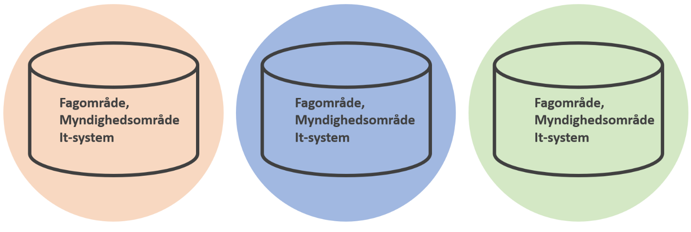

_Figur 5 - Forsimplet illustration over opdeling af forskellige fagområder, myndigheder og it-løsninger i forskellige siloer, som hver især opbevarer og behandler data lokalt_

Der findes i dag mange forskellige fagsystemer på tværs af det offentlige Danmark, som på den ene eller anden måde håndterer observerbare og målbare data på forskellig vis. Data i disse fagsystemer kan være af meget forskellig kvalitet, hvilket ofte afhænger af den konkrete dokumentationspraksis som kan variere imellem forskellige myndighedsområder og eller fagområder. Der er områder med store fagsystemer, som udgør de facto standarder på det pågældende område, og der er fagområder, som er langt i arbejdet med standardisering og strukturering af observerbare og målbare data fx [ICD- diagnose klassifikation](https://www.who.int/classifications/classification-of-diseases) på sundhedsområdet og [Fællessprog III standarden](http://www.fs3.nu/) på det kommunale sundheds- ældre og voksensocialområde.

Der findes dog også fagområder, som er mindre modne, og hvor data ikke i særlig høj grad er strukturerede og standardiserede som fx på socialområdet, som bærer præg af ustrukturerede data ofte i form af længere tekstafsnit, som redegør for den information der er opsamlet om borgerens tilstand. Ustrukturerede data kan medføre at det er vanskeligt at forstå, skabe overblik, sammenligne og anvende data indenfor og på tværs af fagligheder og it-løsninger.

Observerbare og målbare data er grundlæggende med til at give det oplyste datagrundlag som myndigheder i det offentlige Danmark har brug for, for at kunne yde den rette service, den rette hjælp, samt løse mange af deres opgaver indenfor deres pågældende ansvarsområder. Her kan det især være problematisk med mangel på standardisering og strukturering af data, når data fra en myndigheds fagsystem evt. skal forstås, sammenstilles og anvendes af en anden myndighed til at opnå indsigt og viden i specifikke forhold.

#### Den ønskede situation(to-be)

Målet med denne referencearkitektur er at skabe et fælles sprog, forståelsesramme og struktureringsmetode for, hvordan man ensartet kan arbejde med observerbare og målbare data, som forudsætning for bedre at kunne dele og anvende data på tværs af myndigheder, fagområder og it-løsninger i det offentlige.

Referencearkitekturens formål er ikke nødvendigvis at nedbryde siloer på tværs af det offentlige, men snarere hjælpe med at give fagområder og myndighedsområder evnen til at dele gode data imellem deres it-løsninger. Når vi på tværs af det offentlige har data af høj kvalitet som kan deles og forstås af flere parter, opstår muligheden for at anvende og sammenstille viden fra flere fagområder til at opnå nye indsigter, blive klogere på årsagssammenhænge, og anvende data på nye innovative måder og i nye teknologier.

Referencearkitekturen kan også være et middel til at øge intern standardisering og strukturering af observerbare og målbare data inden for et fagområde, myndighed og it-løsning, som på sigt kan være med til, at der leveres data af højere kvalitet og pålidelighed.

Referencearkitekturen er særligt interessant, når det omhandler det spændingsfelt hvor flere fagområder, myndigheder eller it-løsninger har fælles forretningsbehov, databehov eller, anvender de samme begreber og data. Det er ofte i dette spændingsfelt, at der kan opstå udfordringer med at forstå, være enige om data, samt anvende data på tværs, se Figur 6, 7 og 8

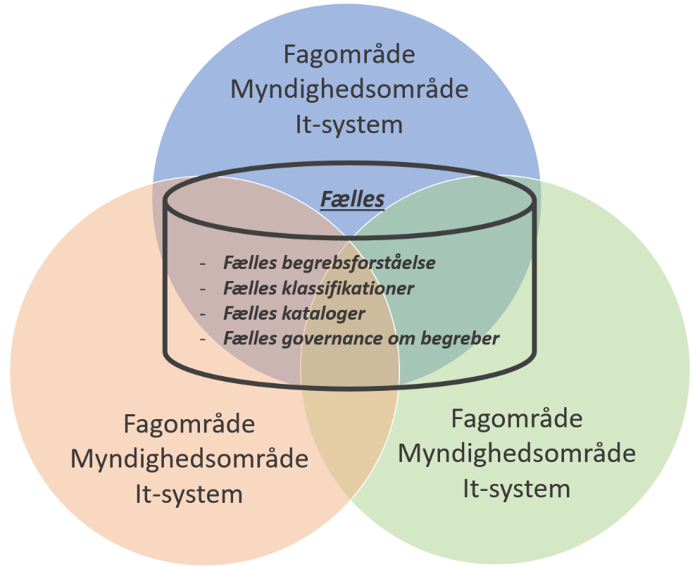

_Figur 6 - Illustration af virkeområdet for et fælles katalog med (observerbare og målbare data) mellem flere fagområder, myndigheder eller it-løsninger._

#### Perioden mellem as-is og to-be

I en betydelig tidsperiode vil der eksistere løsninger, både implementerede og tilgængelige på markedet, som er udviklet før indførelsen af referencearkitekturen. Disse løsninger er derfor ikke konstrueret i overensstemmelse med eller tilpasset til referencearkitekturen. Der vil gå en vis tid, inden løsningerne begynder at blive udviklet og leveret i overensstemmelse med referencearkitekturen.

I løbet af denne overgangsperiode vil det være urealistisk at forvente, at alle eksisterende løsninger straks ombygges, så de opfylder og harmonerer med referencearkitekturen. I stedet kan der blive stillet delvise krav fra referencearkitekturen til it-løsninger for at opnå visse aspekter af den forretningsmæssige værdi. Dette vil gælde i situationer, hvor det ikke er praktisk muligt at insistere på en fuld implementering af referencearkitekturen.

#### Eksempler på to-be scenarier: Fælles forståelse af observations- og måleforhold

De to nedenstående eksempler (Figur 7 og 8), er eksempler på to-be scenarier der skal illustrere hvordan referencearkitekturen kan hjælpe med at der opsamles ensartede og strukturerede resultatdata om det samme observationsobjekt, på tværs af forskellige fagområder (I Figur 7 er observationsobjektet en udsat ung, og i figur 8 er observationsobjektet et afgrænset geografisk område ude i naturen). Og netop fordi der er fælles forståelse og sprog, kan der skabes ensartede resultatdata om det pågældende observationsobjekt, som kan anvendes, deles, forstås, sammenlignes mfl. mellem de forskellige fagområder.

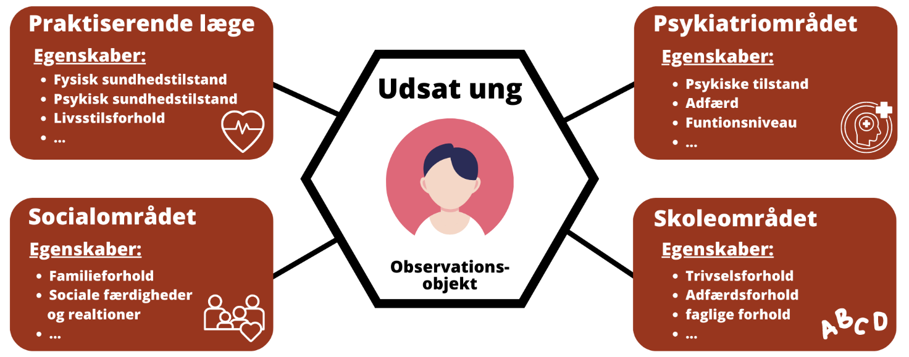

_Figur 7 - Figuren er et eksempel som illustrerer hvilke observerbare egenskaber som kan være interessante og nødvendige at have viden om ift. at hjælpe en udsat ung. Eksemplet viser at der på tværs af forskellige "fagområder" fremfindes viden, som alle kan bidrage til et "komplet" billede af dens unges tilstand, og som er nødvendige for at tilrettelægge den rette hjælp og behandling på de forskellige fagområder samt til at koordinere og planlægge indsatser på tværs af fagområderne. Et katalog over egenskaber på dette område, kan hjælpe med at skabe fælles sprog og ensartet dokumentation af data om den unges tilstand, som potentielt kan deles og anvendes på tværs af fagområderne._

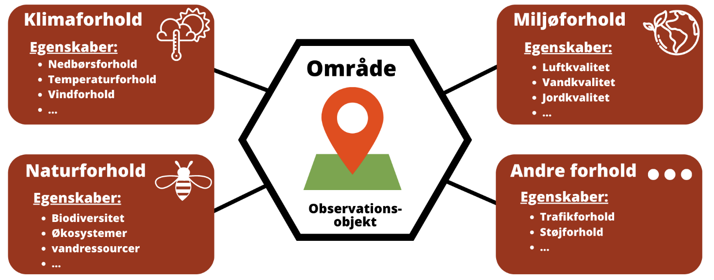

_Figur 8 - Figuren er et eksempel som illustrerer hvilke observerbare egenskaber, som det kan være interessant at sammenstille data om fra forskellige "fagområder" ift. at opnå viden og indsigter om naturen, klimaet og miljøets udviklingen inden for et afgrænset geografisk område._

### Vision

Referencearkitekturen tager udgangspunkt i følgende vision for arbejdet med observerbare og målbare data:

- - -

_Offentlige myndigheder og private aktører_

_deler, genbruger og anvender observerbare og målbare data_

_som er **standardiserede**, **retvisende** og **ensartet**_ _dokumenteret._

- - -

**Standardiserede** betyder, at data "sprogligt" er beskrevet efter fælles rammer. Dette betyder at data ser "ens ud" uanset hvor data er produceret. Standardiserede data bidrager til at skabe samfundsværdi ved, at data bliver et fælles gode, som uden yderligere fortolkning eller bearbejdelse kan anvendes og skabe værdi for andre på tværs af det offentlige.

**Retvisende** betyder, at data kommer fra en troværdig datakilde og er til at stole på. Retvisende data afspejler og gengiver de faktiske forhold, hvilket vil sige, at data ikke er blevet forvansket eller på anden måde ændret.

**Ensartet** **dokumenteret** betyder, at data er dokumenteret ved hjælp af fælles rammer og regler, og at der anvendes fælles sprog og klassifikationer. Dette skal medvirke til, at det er nemt at vurdere datas kvalitet og bidrage til at data, hvor det er relevant, har den samme kvalitet, samt at data kan forstås og anvendes i en bred kontekst.

### Mål

Visionen uddybes af en række mål. I det følgende afsnit redegøres for referencearkitekturens mål og realisering af disse.

#### Mål 1: Data om observerbare og målbare forhold i Danmark og om danske borgere dokumenteres ensartet.

_Referencearkitekturen skal bidrage med fælles rammer til, hvordan observerbare og målbare data kan struktureres og dokumenters, så man opnår ensartet data på tværs af fagligheder og it-løsninger i det offentlige. Ensartet dokumentation af data bidrager både til kvalitetssikring af data, samt en stærkere fælles opfattelse og forståelse af begreber på tværs af den offentlige sektor. Ensartede data er en forudsætning for en bred anvendelse og sammenstilling af data på tværs af fagområder og it-løsninger._

**Realisering af mål:** Referencearkitekturens anvendelsesmodel er opbygget således, at den understøtter ensartet dokumentation af det, som observeres og måles. Ved at anvende referencearkitekturens anvendelsesmodel, som vejledning ift. arbejdet med at udvikle eller understøtte it-løsninger, som skal håndtere observerbare og målbare data, kan brugerne opnå en begrebsafklaring samt "dokumentationsramme", som sikrer, at hver eneste måling og resultat overordnet dokumenteres ensartet og efter de samme rammer. Der vil dog sagtens kunne opstå scenarier, hvor der vil være behov for tilpasninger og eventuelle tilføjelser til referencearkitekturens anvendelsesmodel.

#### Mål 2: Der er opbygget autoritative klassifikationer for observerbare og målbare data som vedligeholdes og deles med relevante parter.

_Et centralt element og en grundlæggende tanke i denne referencearkitektur, er ideen om et fælles sprog til at beskrive egenskaber ved de ting vi måler. Dette fælles sprog kan anvendes til at definere, beskrive og dokumentere og fastlægge relevante egenskaber i klassifikationer. Det er helt centralt at der er enighed og styr på ansvarsfordelingen, ift. de klassifikationer som skal avendes på tværs af flere parter og, at der er enighed om de begreber som udarbejdes, så de opnår en autoritativ anerkendelse og status og bliver anvendt ude i den virkelige verden._

_Ordet Autoritativt henviser til det at have gyldighed eller myndighed. Afledt heraf, at noget er overbevisende og troværdigt. Autoritative klassifikationer gør det muligt, på tværs af et begrebsrigt offentligt Danmark, at definere begreber ensartet samt at fastslå forståelsen af disse begreber en gang for alle. Klassifikationer og begreber kan herefter genanvendes og bruges af myndigheder og it-løsninger på tværs af det offentlige Danmark. Åbne og tilgængelige autoritative klassifikationer er med til at nedsætte risikoen for siloopdelte fagområder og fagsystemer, som hver især sidder med deres egen (ofte indforståede) definition og forståelse af begreber._

**Realisering af mål:** Referencearkitekturen kan være et hjælpemiddel til at anskue et eller flere fagområder og belyse sammenfald og forskelligheder i forhold til terminologi, og på denne måde belyse behovet for fælles sprog. På denne måde kan der skabes et fælles sprog, som kan anvendes til it-understøttelse på fagområder og på tværs af det offentlige. Fælles begrebsforståelse og klassifikationer over egenskaber kan implementeres som et" katalog" et fælles sted hvor flere systemer har adgang til, eller klassifikationerne kan implementeres i de enkelte fagsystemer. Det vigtigste er at klassifikationerne, uanset hvordan de implementeres, opbygges efter referencearkitekturens anvendelsesmodeller og evt. udstilles/deles, da det er dem, som sikrer fælles og ensartet dokumentation og sprog omkring de data, som opsamles og dokumenteres.

At anvende denne referencearkitektur sikrer ikke fælles autoritative klassifikationer. Det er et stort og krævende arbejde at opnå fælles enighed omkring begreber. Referencearkitekturen udgør en metodemæssig ramme, som kan anvendes til at beskrive begreber ensartet.

#### Mål 3: It-løsninger er sammenhængende og semantisk interoperable.

_Referencearkitekturen skal bidrage til, at observerbare og målbare data bliver et fælles gode, som er anvendelig på tværs af fagområder og -systemer. Data skal fremover være en fælles "ressource", som kan anvendes til at skabe sammenhæng mellem fagområder og -systemer i det offentlige og private. Hvis data skal benyttes til at løse fælles opgaver, er det en forudsætning, at der er sammenhæng og fælles forståelse omkring det sprog og de begreber som skal avendes på tværs af it-løsninger._

**Realisering af mål:** Interoperabilitet er en forudsætning for at skabe sammenhæng på tværs af organisationer og it-løsninger. I EU har det "European Interoperability Framework" (EIF)[\[1\]](#fodnoter) angivet interoperabilitet i flere niveauer[\[2\]](#fodnoter), hvor særligt niveauet om semantisk interoperabilitet[\[3\]](#fornoter) er helt centralt at understøtte for denne referencearkitektur. Semantisk interoperabilitet opnås ved at anvende de fælles rammer for dokumentation af observerbare og målbare data, som defineres i referencearkitekturen.

Referencearkitekturen har ligeledes til formål at bidrage til øget interoperabilitet mellem myndigheder og relevante organisationer ved at bidrage med fælles strategiske retning, mål og styring for arbejdet med observerbare og målbare data. Referencearkitekturen kan derudover bidrage med at opnå teknisk interoperabilitet mellem systemer, hvis der bygges et fælles eller flere sammenhængende fysiske egenskabskataloger som it-løsninger kan tilgå.

Ift. deling og udstilling af observerbare og målbare data er der forskellige juridiske og sikkerhedsmæssige bindinger på forskellige fagområder og deres data, som der skal tages hensyn til. Referencearkitekturen kan være med til at sikre fælles sprog og fælles forståelse af data, men ikke at data nødvendigvis må og kan deles på tværs af det offentlige eller med andre relevante organisationer.

#### Mål 4: Danske standarder og løsninger er kompatible med nationale og internationale standarder

_Referencearkitekturen skal bidrage til, at data og datastandarder i it-løsninger på tværs af det offentlige Danmark, er kompatible med relevante nationale og internationale standarder, som er relevante indenfor området for observerbare og målbare data._

**Realisering af mål:** Referencearkitekturen bygger på konkrete dataspecifikationer, datastandarder og ontologier omhandlende observation og måling fra INSPIRE direktivet, ISO og W3Cs. Læs mere om dette i afsnittet om referencearkitekturens [tilblivelse](#tilblivelse).

#### Mål 5: Løsninger til observation og måling er fleksible, robuste og modtagelige for tilføjelser/ændringer efter behov

_Referencearkitekturen skal, med den rigtige implementering af anvendelsesmodellen, bidrage til at sikre at systemer bliver robuste over for de helt naturlige ændringer, som sker inden for et fagområde. Dette er centralt, dels fordi vi bliver klogere undervejs, og dels fordi krav og lovgivning ændrer sig løbende på de fleste fagområder, hvilket ofte resulterer i ændringer i fagsystemer._

**Realisering af mål:** Et vigtigst aspekt ved referencearkitekturen er at opnå fleksible systemer, som relativt nemt kan ændres efter brugernes behov. Dette aspekt opnås ved, at de dele af forretningen/fagområdet som hyppigt er under forandring ikke kodes direkte ind i it-løsningens "mave", som faste attributter i databaserne. I stedet opbygges et "fleksibelt klassifikationskatalog", som en løst koblet del af it-løsningen, hvor det er muligt at ændre, tilføje eller slette forandringer uden at skulle ændre i selve koden for it-løsningen og dertilhørende databaser. Observerbare egenskaber er oplagte at lægge i et katalog for sig selv, da det over tid kan variere, hvilke egenskaber brugerne ønsker at dokumentere data omkring. Det kræver naturligvis, at applikationen er bygget på en måde, der respekterer anvendelsesmodellen og fungerer med samme fleksibilitet. Se kapitlet [applikation](#applikation).

### Arkitekturprincipper

Hvidbogen om den fællesoffentlige digitale arkitektur opsætter en række [arkitekturprincipper](https://arkitektur.digst.dk/principper-og-regler), som er operationaliseret i en række [arkitekturregler](https://arkitektur.digst.dk/principper-og-regler), der giver anbefalinger til projekter, som led i den overordnede rammesætning og styring af offentlig digitalisering. Referencearkitekturen understøtter en række af disse og kan bidrage til at realisere dem.

**Tabel 4** kommer med anbefalinger til, hvordan et projekt som anvender denne referencearkitektur, bør forholde sig til og udmønte de fællesoffentlige arkitekturregler.

|            |                                                                                           |                                                                                                                                                                                                                                                                                                                                                                                                                                                                                        |
| ---------- | ----------------------------------------------------------------------------------------- | -------------------------------------------------------------------------------------------------------------------------------------------------------------------------------------------------------------------------------------------------------------------------------------------------------------------------------------------------------------------------------------------------------------------------------------------------------------------------------------- |
| **AR**     | **Beskrivelse**                                                                           | **Udmøntning**                                                                                                                                                                                                                                                                                                                                                                                                                                                                         |
| **AR 1.1** | Styr arkitekturen på rette niveauer og sammenhængende                                     | Reglen betyder, at projekter skal tage stilling til om de bør anvende eller udvikle og dele fælles klassifikationer, datamodeller, udvekslingsformater eller komponenter, og i den sammenhæng sikre, at der er den relevante ramme for styring. Det er særlig relevant, hvis projektet vedrører opgaver og data der går på tværs af flere aktører og domæner.                                                                                                                          |
| **AR 1.2** | Optimér arkitektur efter projektets og de fælles mål.                                     | Reglen betyder, at projekter så tidligt som muligt skal tage stilling til scope og inddragelse, hvis der er et potentiale for at udvikle fælles løsningsbyggeblokke, fx fælles klassifikationer, der kan anvendes i en bredere kontekst end projektet selv, i form af egenskabsklassifikationer.                                                                                                                                                                                       |
| **AR 1.3** | Anvend fælles ramme for beskrivelse af arkitekturen                                       | Reglen betyder at projekter skal følge FDA's retningslinjer for arkitekturdokumentation, herunder regler for begrebs- og datamodellering. Ved egen profilering og videreudviklingen af referencearkitekturens anvendelsesmodel, skal rammer og regler jf. FDA-retningslinjer overholdes.                                                                                                                                                                                               |
| **AR 1.4** | Sørg for review af projektets arkitektur                                                  | Reglen betyder, at projekter, som har potentiale i forhold til at anvende eller udvikle fælles løsningsbyggeblokke bør undergå et arkitektur-review med henblik på at kvalitetssikre projektets leverancer.  Projekter som udvikler modeller, herunder begrebslister, egenskabsklassifikationer, datamodeller og udvekslingsformater bør sørge for kvalitetssikring i forhold til genbrug med relevante interessenter, herunder fx via model-review i regi af FDA.               |
| **AR 1.5** | Hav tilstrækkelige kompetencer til arkitekturarbejdet                                     | Reglen betyder, at projekter skal sikre, at der udover den nødvendige emnefaglighed og kompetence i forhold til de tekniske løsningsmuligheder også skal være kompetencer til at udarbejde og arbejde med klassifikationer jf. de arkitektur rammer og regler som referencearkitekturen og referencearkitekturens anvendelsesmodel opsætter.                                                                                                                                           |
| **AR 2.1** | Anvend og udbyg den fællesoffentlige rammearkitektur                                      | Reglen betyder, at projekter skal tage stilling til om de bør anvende og genbruge eller udvikle og dele fælles klassifikationer, datamodeller, udvekslingsformater eller komponenter med andre, og om dette skal ske via FDA. Eksempelvis som en del af [FDA's modelkatalog](https://arkitektur.digst.dk/genbrug/kataloger/modelkatalog).                                                                                                                                              |
| **AR 2.2** | Anvend åbne og internationale standarder                                                  | Reglen betyder, at projekter som udgangspunkt skal tage udgangspunkt i de standarder, som referencearkitekturen udpeger, og derudover orientere sig om internationale arbejder, der enten danner profiler på disse eller supplerer disse. Derudover skal projektet naturligvis være opmærksom på og tage udgangspunkt i om der er gældende standarder på det opgave- og emneområde, som projektet arbejder med.                                                                        |
| **AR 2.3** | Undgå afhængighed af leverandører og proprietærer teknologier                             | Reglen betyder, at særligt projekter der anskaffer teknisk udstyr med indbyggede datamodeller og komponenter, er i stand til at overholde referencearkitekturens anbefalinger. Det kan fx være i forhold at overholde fælles udvekslingsformater og protokoller eller anvende fælles komponenter og services.                                                                                                                                                                          |
| **AR 2.4** | Byg med udgangspunkt i brugeren og forberedt til forandring                               | Reglen betyder, at projektet skal sikre at de elementer i en løsning der kan ændre sig fx pga. ændret lovgivning, ændret faglig viden og metode eller nye behov, kan tilpasses. Det kan fx ske ved at egenskabsklassifikationer håndteres i løst koblede komponenter.                                                                                                                                                                                                                  |
| **AR 2.5** | Stil data og løsninger til rådighed for private                                           | Reglen betyder, at projekter dels skal være opmærksomme på, at egenskabsklassifikationer stilles til rådighed for private samarbejdspartnere, som indgår i selve opgaveløsningen, dels skal være opmærksomme på, at stille klassifikationer til rådighed for en bredere anvendelse, hvor det er muligt og relevant, under behørigt hensyn til licenskrav o.l.                                                                                                                          |
| **AR 3.1** | Tag højde for juridiske bindinger i forhold til deling og genbrug af data og it-løsninger | Reglen betyder fx at projekter skal være opmærksomme på om der er særlige juriske krav eller begrænsninger i forhold til håndtering af persondata, særlig ressortlovgivning eller domænespecifikke krav til anvendelse af særlige metoder, standarder og infrastruktur. Der kan fx også være krav til autorisation af registranter, certificering af udstyr og licenser i forhold til fx anvendelse af klassifikationer.                                                               |
| **AR 3.2** | Bidrag til digitaliseringsklar lovgivning                                                 | Det betyder, at projekter skal være opmærksomme på, om der i gældende lovgivning er uhensigtsmæssige begrænsninger i forhold til at følge referencearkitekturen og i forhold til projektets mål. I givet fald kan det være relevant at undersøge, om der er mulighed for at ændre i relevant lovgivning.                                                                                                                                                                               |
| **AR 4.1** | Opfyld krav til informationssikkerhed og privatlivsbeskyttelse                            | Reglen betyder, at projekter skal følge de generelle krav til håndtering af informationssikkerhed, men herunder være særligt opmærksomme på end-to-end håndtering af persondata og fortrolige data.                                                                                                                                                                                                                                                                                    |
| **AR 4.2** | Anvend fælles arkitektur for informationssikkerhed                                        | Det betyder, at projekter der anvender løst koblede komponenter, særligt i tværgående løsninger skal være opmærksomme på at anvende brugerstyringsløsninger, der understøtter fælles sikkerhedsmodel og føderation. Det kan fx være i forhold til end-to-end sikkerhed fra registrering til anvendelse eller i forhold til at anvende en fælles klassifikationsservice.                                                                                                                |
| **AR 5.1** | Design sammenhængende brugerrejser                                                        | Reglen betyder fx, at projekter skal være opmærksomme på om der anvendes de samme sprog, termer, klassifikationer og udfaldsrum i løsninger, der går på tværs af forskellige tekniske komponenter og løsninger. Det kan fx være i forbindelse med konfiguration af udstyr til opsamling af data hjemme hos en borger, der derefter skal kunne vises i en digital selvbetjeningsløsning. Borger/bruger skal kunne se egne data over tid som er struktureret og beskrevet på samme måde. |
| **AR 5.2** | Optimer tværgående processer efter fælles mål                                             | Reglen betyder fx, at projekter skal være opmærksomme på om der anvendes de samme sprog, termer, klassifikationer og udfaldsrum i løsninger, der går på tværs af forskellige aktørers processer og it-løsninger.                                                                                                                                                                                                                                                                       |
| **AR 6.1** | Del og genbrug data                                                                       | Reglen betyder, at projekter skal sikre, at relevante myndigheder stiller relevante resultat- og referencedata til rådighed for relevante parter. Hvor der er behov for det, laves der en klar aftale om ansvar i forhold til indsamling, dokumentation, udstilling, opdatering og anvendelse af data.                                                                                                                                                                                 |
| **AR 6.2** | Anvend fælles regler for dokumentation af data                                            | Det betyder, at projekter som skal udvikle en anvendelsesprofil på anvendelsesmodellen skal følge FDA-regler for begrebs- og datamodellering.                                                                                                                                                                                                                                                                                                                                          |
| **AR 6.3** | Giv data den kvalitet som efterspørges                                                    | Det betyder, at projekter dels kan anvende selve anvendelsesmodellen til at beskrive datakvalitet, som herudover kan suppleres i en metadatabeskrivelse, hvor man kan tage udgangspunkt i FDA [Fælles sprog for datakvalitet](https://arkitektur.digst.dk/node/625).                                                                                                                                                                                                                   |
| **AR 6.4** | Udstil oplysninger om datakilder, begreber og datamodeller                                | Det betyder, at projekter skal dele deres resultatdata, med relevante parter via en egnet platform. Delte data bør udstilles efter fælles datamodel eller med mapning til fælles datamodel. Hvis projektet udvikler egne referencedata (anvendelsesmodel, anvendelsesprofil, egenskabsklassifikation) bør disse udstilles i et egnet katalog (fx et begrebskatalog, klassifikationskatalog eller en egentlig klassifikationsservice).                                                  |
| **AR 7.1** | Design og udstil snitflader efter fælles integrationsmønstre og tekniske standarder       | Det betyder, at projektet skal være opmærksom på hvilke komponenter, der indgår i den samlede løsning, hvilke funktioner, services og snitflader der skal implementeres i hvilke komponenter, samt hvilke protokoller der skal understøttes i de enkelte snitflader. Projekter skal særligt være opmærksomme på (potentielle) fælles løsninger og eksterne snitflader.                                                                                                                 |
| **AR 8.1** | Levér data og services i henhold til aftalte servicemål                                   | Det betyder, at projektet skal tage stilling til om der særligt i forbindelse med deling af resultatdata og referencedata i et løst koblet økosystem er særlige krav til platform, datalagring, SLA og generelt i forhold til robusthed, sikkerhed, fleksibilitet og skalérbarhed.                                                                                                                                                                                                     |

_Tabel 4 - Gode overvejelser til hvordan projekter ved hjælp af referencearkitekturen kan udmønte de fællesoffentlige arkitekturregler_.

## Jura

Kapitlet giver et kort indblik i de overordnede juridiske bindinger, der kan forekomme i arbejdet med observerbare og målbare data.

### Lovgivning

Eftersom referencearkitekturen kan anvendes på forskellige fag- og myndighedsområder, vil det være meget forskelligt, hvilke data der arbejdes med, anvendes og evt. deles. Det vil derfor også være forskelligt, hvilke lovgivninger og forordninger, som skal overholdes i arbejdet med data.

Generelt skal man i forhold til observerbare og målbare data særligt være opmærksom på eventuelle særlige krav eller begrænsninger i relevant lovgivning (eksempelvis GDPR, Databeskyttelseslovgivningen, Lov om behandlingen af persondata mfl.) eller anden regulering forhold til

* deling af data, herunder hensyn til sikkerhed og privatliv
* kvalitet og egenskaber ved de data der indsamles
* anvendelse af (internationale) standarder for metoder og datamodeller
* certificering i forbindelse med fastlæggelsen af nationale standarder
* certificering ved anskaffelse af måleudstyr og opsamlingsenheder
* tilslutning til fælles (domæne)infrastruktur

### Licenser

Der kan være særlige krav til, at de personer/personale der observerer og opsamler målingsdata, har særlige kompetencer eller autorisationer.

Ved anvendelse, udstilling og deling af egenskabsklassifikationer til deling og genbrug skal projektet være opmærksomt på eventuelle licenskrav tilknyttet anvendte standarder m.m.

Ved anskaffelse af udstyr til observation og måling kan der ligeledes være domænespecifikke krav til certificering og licenser. Et eksempel er krav på sundhedsområdet til Continua-certificering af udstyr, jf. fx Referencearkitektur for opsamling af helbredsdata hos borgeren[\[4\]](#fodnoter).

Endelig kan der være krav til kvalifikationer og autorisationer af aktører og personer der observerer, måler og registrerer data.

### Viljetilkendegivelse

Viljetilkendegivelse i forbindelse med indsamling af data ved observation og måling refererer til processen med at indhente samtykke eller tilladelse fra de personer, hvis data indsamles ved observation og måling. Det indebærer at informere og få accept fra de berørte personer om, hvordan deres data vil blive indsamlet, behandlet, og deles med andre. Det vil være forskelligt fra område til område om der er behov for samtykke, men ofte når det handler om personoplysninger, er det vigtigt at haves styr på om man har rettigheder til at indsamle og anvende personers data.

### Ansvar

De enkelte offentlige myndigheder er selv ansvarlige for sikkerheden i egne løsninger, som håndterer observerbare og målbare data. Herunder at det er de rette personer som foretager observationer/målinger og har som adgang til det udstyr som anvendes.

Man skal sikre sig, at der er foretaget en informationssikkerhedsmæssig risikovurdering af løsningen, og at der er etableret sikringsforanstaltninger, der reducerer risici til et niveau, der kan accepteres af den dataansvarlige.

Et eksempel på et særligt opmærksomhedspunkt i forhold til observation og måling er, hvis personidentifikation er nødvendig at foretage i måleudstyr, eksempelvis i en lokal opsamlingsenhed placeret hos en borger. Her skal man være særligt opmærksom på at sikre sig, at der er etableret de nødvendige sikringsforanstaltninger for at undgå, at uvedkommende kan få adgang til fortrolige oplysninger. Derudover skal man sikre sig, at det kun er de personer, som var tiltænkt skulle anvende udstyret, der rent faktisk er dem, som anvender det.

### Standarder

Myndigheder, der anvender referencearkitekturen, skal i deres sikkerhedspolitik og risikostyring inddrage sikkerhedsmæssige forhold om organisering, data (informationer), teknik og interoperabilitet i de tilfælde, hvor data udstilles og deles med andre løsninger. Dette er helt generelt ift. datadeling og derfor skal myndigheder leve op til generelle principper og krav for datadeling herunder ISO 2700x[\[5\]](#fodnoter).

Myndighederne skal tage udgangspunkt i ISO/IEC 27001-standarden for håndteringen af informationssikkerheden, som vil variere alt efter, hvilken løsning man vælger at implementere og hvilke data, man skal til at håndtere.

Digitaliseringsstyrelsen har i samarbejde med Erhvervsstyrelsen udarbejdet vejledninger, værktøjer og skabeloner, som kan hjælpe myndighederne med håndteringen af sikkerheden[\[6\]](#fodnoter).

### Opmærkning af følsomhed og fortrolighed

Det kan være hensigtsmæssigt at opmærke observerbare egenskaber efter deres følsomhed på visse forretningsområder, hvor resultatdataene fra observation og måling kan være følsomme eller fortrolige. På denne måde kan man opbygge en klassifikation af observerbare egenskaber inden for et bestemt forretningsområde, der identificerer de egenskaber, der "producerer" følsomme og/eller fortrolige resultater. Der findes forskellige standarder og klassifikationer til at opmærke følsomhed og fortrolighed, for eksempel kan [persondatalovens kategorier for personoplysninger](https://www.retsinformation.dk/eli/lta/2018/502) anvendes til opmærkning (følsomme personoplysninger, ikke-følsomme personoplysninger, ikke-personoplysninger og oplysninger om strafbare forhold).

## Opgaver

Dette kapitel beskriver hvordan referencearkitekturens anvendelsesmodel kan understøtte opgavehåndteringen og give værdi ift. arbejdet med observerbare og målbare data ved kortfattet at gennemgå de typiske, generelle opgaver der er i forbindelse med håndtering af observerbare og målbare data.

**Figur 9** viser seks procestrin som hver især redegør for centrale opgaveområder og opgaver ift. blandt andet fælles metode, konfiguration, indsamling, lagring, udstilling, databehandling og anvendelse af observerbare og målbare data.

### Procestrin

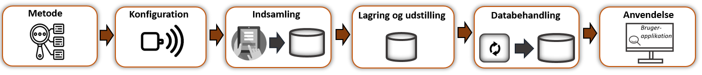

_Figur 9 - Procestrin ifb. med indsamling, håndtering og anvendelse af observerbare og målbare data_

1. **Angivelse af metode (egenskabsklassifikationer)**
   * Definition af måle- eller observationsmetode og egenskabsklassifikationer som forudsætning for konfiguration og indsamling af data
   * Dokumentation af anvendt metode (kan ske før eller efter datafangst)
   * Mapning, fx mellem proprietær model og fælles model
2. **Udvælgelse af udstyr/Konfiguration af udstyr**
   * Konfiguration af udstyr efter metode/standard til konkret anvendelsesscenarie
   * Instruktion af registrant til at indsamle data efter metode
3. **Indsamling (Registrering)**
   * Automatisk via udstyr eller manuelt via indtastning af registrant i applikation
   * Direkte i fagsystem / anvendersystem eller via lager / databehandling
4. **Lagring og udstilling (deling) / Videregivelse (distribution)**
   * Lagring af data decentralt eller centralt, hvor data gøres tilgængeligt for relevante parter
   * Opmærkning med metadata om datasæt, metode, kvalitet
   * Udstilling af snitflade / API med valg af metoder til Forespørgsel (pull) eller Meddelelse (besked/ notifikation/push)
5. **Databehandling (Klargøring til slutbruger)**
   * Sammenstilling af data på tværs af flere datakilder
   * Transformation af data med brug af en eller flere anvendelsesprofiler og mapninger
6. **Slutbrugeranvendelse**
   * Læsning og anvendelse af data i anvendelsessystem
   * Sammenstilling af data i anvendelsessystem
   * Visning/udstilling af data til slutbrugere

NB. Procestrinene kan i virkelighedens verden ske i forskellige mønstre, med variationer i rækkefølge og frekvens.

Fx i forhold til **hvornår** der sker en harmonisering af data:

* Processen kan starte med fælles, koordineret planlægning af metode for registrering

eller

* Processen kan starte med ukoordineret registrering med forskellige metoder, hvorefter metode tænkes ind efter lagring af proprietærer data, hvor den fælles metode først bringes i spil i forbindelse med transformation og sammenstilling.

Eller fx hvor **kompleks** processen er:

* Processen kan være kort fra indsamling og registrering af data direkte til slutbrugeranvendelse

eller

* Processen kan være lang med flere mellemtrin, hvor data samles i et eller flere lagre og måske skal nogle data transformeres fra ét eller flere forskellige (proprietærer) format(er) til et fælles format før de kan sammenstilles, behandles og præsenteres for en slutbruger.

### Metodeunderstøttelse er central ift. opgaveløsning

Procestrinene viser hvordan referencearkitekturen og dens anvendelsesmodel kan understøtte hele rejsen fra skabelsen af observerbare og målbare data til anvendelsen af data i en konkret anvendelsessituation.

Grundlaget er en fælles metodeunderstøttelse som kan hjælpe projekter til at definere eller genbruge eksisterende observations- og målemetoder i form af bl.a. egenskabsklassifikationer.

Egenskabsklassifikationen kan derfor ses som en forudsætning for at løse opgaver og problemstillinger ift. at konfigurere udstyr og registreringsmetode, og for at indsamle, lagre, udstille, databehandle og anvende observerbare og målbare data.

_Figur 10 - Velbeskrevne og veldokumenterede metoder, fx i form af egenskabsklassifikationer​​​​​er centralt ift. at løse opgaver og problemstillinger ift. at fremskaffe, dele og anvende observerbare og målbare data._

### Kort beskrivelse af de seks procestrin

Her uddybes de seks generiske procestrin kort med en angivelse af, hvordan egenskabsklassifikationer kan indgå.

#### 1\. Definition af måle og observationsmetode

Proces hvor der defineres en tilgang til observation og måling indenfor et genstandsfelt. Dette kan udformes som en anvendelsesprofil på anvendelsesmodellen med en eller flere egenskabsklassifikationer, der kan anvendes som fælles standard i forhold til genstandsfeltet.

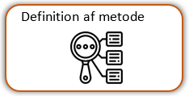

#### 2\. Implementering/Konfiguration af udstyr og instruktion af registrant

Proces hvor udstyr konfigureres, fx hos leverandøren, af en specialist hos forretningen eller af en slutbruger, fx borgeren selv. Denne proces kan tilsvarende omfatte instruktion af en registrant ift. konkrete dokumentations- og registreringspraksisser. Dette kan også indebærer opsætning af udstyr i "målemiljøet", altså der hvor det skal anvendes.

Denne proces kan anvende en egenskabsklassifikation til konfiguration af udstyr, eller som metodeanvisning for registrering og dokumentation af data.

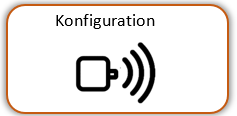

#### 3\. Indsamling og registrering

Proces hvor selve datafangsten sker. Det kan enten være via en person der anvender udstyr eller software til at indsamle og registrere data som en del af et fagsystem, eller et apparat med relevant sensor og funktionalitet til at observere og registrere data og lagre eller evt. videregive dem til evt. anden enhed.

Denne proces kan anvende en egenskabsklassifikation, fx som støtte for manuel registrant. Et apparat kan evt. sættes op til at lytte på opdateringer af en egenskabsklassifikation, så det løbende kan holdes konfigureret efter seneste version af aftalt "standard".

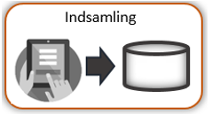

#### 4\. Lagring og udstilling

Proces hvor data samles på et lager. Her kan eventuelt ske en konsolidering og indeksering af data. Data kan eventuelt udstilles fra det oprindelige kildelager eller et dedikeret distributionslager.

Denne proces kan anvende en egenskabsklassifikation som dokumentation af (metadata om) et konkret datasæt.

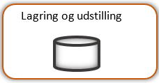

#### 5\. Databehandling

Proces hvor data sammenstilles logisk og evt. fysisk, fx efter at de er hentet fra flere datakilder. Processen kan også omfatte transformation, fx fra forskellige modeller til fælles model, eller fx fra dansk til engelsk sprog.

Denne proces kan anvende en eller flere egenskabsklassifikationer som grundlag for sammenstilling og transformation.

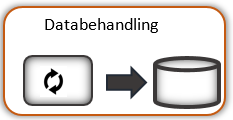

#### 6\. Anvendelse

Proces hvor en slutbruger anvender data til en konkret opgaveløsning. Det kan fx være en medarbejder der skal følge en udvikling eller oplyse en sag, eller en borger der skal se resultater af sundhedsmålinger fra behandler, laboratorie eller eget udstyr.

Denne proces kan anvende en egenskabsklassifikation som grundlag for struktur og præsentation af data, herunder som kilde til forklarende tekst som støtte til slutbruger.

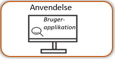

### Anvendelsesscenarier

Nedenfor er listet tre overordnede anvendelsesscenarier, som belyser behovet og gevinsterne ved at anvende, dele og genbruge observerbare og målbare data.

* **At følge en udvikling** - som forudsætning for at vide, hvordan specifikke forhold ændrer sig over tid

* **At have et oplyst datagrundlag** - som forudsætning for at reagere og yde den rette service

* **Sammenstille data fra flere parter** - som en forudsætning for at sammenstille og sammenligne data og opnå nye indsigter på tværs af forskellige aktører og fagområder

#### At følge en udvikling

Observerbar og målbare data anvendes til at fortælle, hvordan noget specifikt tager sig ud på et bestemt tidspunkt. Ofte er det nødvendigt løbende at indsamle data over en tidsperiode omkring de samme forhold for at holde øje og følge en udvikling over tid. Det kan fx være i forbindelse med observationsobjektets egen udvikling eller udvikling i forbindelse med en indsats:

* **Egen udvikling**: Det kan handle om at følge en "naturlig" udvikling, hvor udviklingen ikke påvirkes aktivt gennem en indsats, men blot kontrolleres. Det kan f.eks. være at følge havets påvirkning på en kystlinje.

* **Indsatsvirkning**: Det kan handle om at følge en udvikling, hvor man igangsætter en indsats, som har til formål at påvirke udviklingen i en specifik retning. Det kan f.eks. være i forbindelse med igangsættelse af et konkret behandlingsforløb for en patient.

#### At have et oplyst datagrundlag

Observerbare og målbare data kan give viden om, hvordan specifikke forhold tager sig ud på bestemte tidspunkter og er ofte en forudsætning for, at de fleste offentlige myndigheder og andre aktører kan yde den rette service samt løse flere af deres opgaver på baggrund af et oplyst datagrundlag.

I situationer hvor et oplyst grundlag skal dannes ved at samle oplysninger fra forskellige kilder, er det vigtigt at have valide, standardiserede og strukturerede data. Semantikken skal være klar og forståelig for sagsbehandleren og derfor kan der være behov for en kvalitetssikring i form af harmonisering eller mapning af data ud fra deres semantiske betydning.

#### Sammenstilling af data

Observerbare og målbare data er ikke mindst interessante, når det omhandler det spændingsfelt, hvor forskellige fagområder kan anvende og sammenstille data fra hinanden til at opnå ny viden og indsigt. Det er dog ofte i dette spændingsfelt, at der kan opstå udfordringer med at forstå og anvende data på tværs.

Der er et utal af situationer, hvor der det kan give værdi at anvende observerbare og målbare data på tværs af forskellige aktører og fagområder. Det kan f.eks. være for at opnå ny viden eller facilitere tværgående samarbejde:

* **Nye årsagssammenhænge**: Observerbare og målbare data kan f.eks. anvendes til at finde årsagssammenhænge indenfor og på tværs af fagområder, som kan give helt nye indsigter i folkesundhed og klimaet mfl.

* **Tværgående processer**: Deling af observerbare og målbare data være en nødvendighed i tværgående behandlingsforløb hvor, der indsamles data fra forskellige myndigheder om borgeren/patienten.

#### Tænkt eksempel - Scenarier for harmonisering af data fra mange forskellige kilder

I dette eksempel er udgangspunktet, at der skal opsættes en lang række IoT-sensorer på tværs af Danmark. De skal indsamle data om luftforurening, herunder trafikforurening, luftkvalitet og andre miljø- og klimaforhold. Formålet er at kunne sammenligne niveauet af luftforurening på tværs af Danmark. Indsamlingen af data sker decentralt og lagres til at starte med lokalt i forskellige løsninger.

Data skal i sidste ende kunne samles og analyseres i sammenhæng og på forskellige måder ud fra forskellige behov.

Dette kan løses på en række forskellige måder så det sikres, at data kan sammenlignes på tværs af Danmark. Dog er det helt centralt at der defineres en fælles metode og en eller flere relevante egenskabsklassifikationer for data om luftforurening. Det kan enten ske ved at vælge eksisterende klassifikationer eller udvikle en ny fælles.

I forhold til konkret implementering kan der grundlæggende være to scenarier: Enten starter man med at konfigurere efter fælles standard ellers må man efterfølgende mappe eller eventuelt transformere data efter fælles standard.

* **Koordineret konfiguration af udstyr og metode for indsamling**I dette scenarie sker der en indledende planlægning og koordinering, så alle IoT-sensorer konfigureres efter samme metode (f.eks. en egenskabsklassifikation for luftforurening), så data indsamles ensartet af alle IoT-sensorer, hvorefter data kan lagres ensartet og herefter deles, anvendes og forstås på tværs.

* **Efterfølgende mapning og transformation af indsamlet data**I dette scenarie anvendes allerede eksisterende sensorer som har forskellige (eventuelt proprietærer) formater. Det betyder, at data i forbindelse med sammenstilling skal mappes og eventuelt transformeres. Dvs. at de forskellige formater skal mappes til fælles logisk model og om nødvendigt skal data transformeres til fælles fysisk format. Dette kan med fordel ofte ske i en central løsning hvor alle datakilder leverer data til.

## Information

Dette kapitel præsenterer referencearkitekturens kerne i form af en begrebsliste med definitioner og forklaringer af de centrale begreber, en overordnet præsentation af den konceptuelle anvendelsesmodel der sætter begreberne i sammenhæng og introduktion til en informationsmodel, der folder anvendelsesmodellen ud med en række detaljer.

Kapitlet redegør for de meste centrale begreber (forretningsobjekter) ift. konceptet at observere og måle. Herudover indeholder dette kapitel udsnit af den underliggende mere detaljerede informationsmodel. For en fuld beskrivelse af modellen henvises til dokumentet [Anvendelsesmodel for observation og måling](https://data.gov.dk/model/profile/ObservationAndMeasurement/ObservationAndMeasurement.html), hvor de centrale forretningsobjekter er mere detaljeret repræsenteret som modelelementer med relationer og attributter, samt yderligere beskrivelser.

### Centrale begreber

Tabel 5 beskriver de centrale begreber i anvendelsesmodellen. Det er disse forretningsobjekter som til sammen udgør kernen i det fælles sprog om observerbare og målbare data.

_Tabel 5 - Begrebsliste med centrale forretningsobjekter, med dertilhørende relevante kommentarer, eksempler og kildeangivelser. Der kan være mindre forskelle på kommentarer og eksempler i denne liste og selve anvendelsesmodellens beskrivende felter. Anvendelsesmodellens felter genbruger definitioner, kommentarer osv. en til en fra de bagvedliggende standarder den er baseret på. I denne begrebsliste kan der være yderligere supplerende tekst, som er tilføjet for at gøre begreberne mere forståelige i en dansk kontekst._

|                            |                                                                |                                                                                                                                                                                          |                                                                                                                                                                                                                                                                                                                                                                                                                                                                                                                          |                                                                                                                                                                                                                |                                                                                                                                                                                                                                                                             |
| -------------------------- | -------------------------------------------------------------- | ---------------------------------------------------------------------------------------------------------------------------------------------------------------------------------------- | ------------------------------------------------------------------------------------------------------------------------------------------------------------------------------------------------------------------------------------------------------------------------------------------------------------------------------------------------------------------------------------------------------------------------------------------------------------------------------------------------------------------------ | -------------------------------------------------------------------------------------------------------------------------------------------------------------------------------------------------------------- | --------------------------------------------------------------------------------------------------------------------------------------------------------------------------------------------------------------------------------------------------------------------------- |
| **Foretrukken term**       | **Accepteret term**                                            | **Definition**                                                                                                                                                                           | **Kommentar**                                                                                                                                                                                                                                                                                                                                                                                                                                                                                                            | **Eksempel**                                                                                                                                                                                                   | **Kilde/afledt af**                                                                                                                                                                                                                                                         |
| **Observation**            | Observations-aktivitet,  Måling,  Målingsaktivitet | Det at udføre en observationsprocedure for at estimere eller beregne en værdi af en egenskab af et genstandsfelt.                                                                        | Henviser til en sensor for at beskrive, hvad der foretog observationen og hvordan; henviser til en observerbar egenskab for at beskrive, hvad resultatet er et estimat af, og til et genstandsfelt for at detaljere, hvad denne egenskab var forbundet med.                                                                                                                                                                                                                                                              | Aktiviteten med at estimere intensiteten af et jordskælv ved hjælp af Mercalli-intensitetsskalaen er en observation, ligesom det er at måle momentets størrelse, dvs. den energi, der frigives af jordskælvet. | **W3C** PROV[**\[1\]**](#fodnoter)**:**  _Activity_  W3C [SOSA](https://www.w3.org/TR/vocab-ssn/#SOSAObservation)[\[2\]](#fodnoter):  _Observation_  **ISO** [O&M](https://www.iso.org/standard/32574.html)[\[3\]](#fodnoter):  _Observation_ |
| **Observations-objekt**    | Forretnings-objekt                                             | Ting, hvis egenskaber estimeres eller beregnes i løbet af en observation for at nå frem til et resultat.                                                                                 | Et observationsobjekt bruges til at redegøre for det forretningsobjekt, som er i fokus og som der ønskes at fremfindes resultater om.                                                                                                                                                                                                                                                                                                                                                                                    | Når man måler højden af et træ, er højden den observerede egenskab, 20 m kan være resultatet af observationen, og træet er observationsobjektet                                                                | **W3C** [SOSA](https://www.w3.org/TR/vocab-ssn/#SOSAFeatureOfInterest): _FeatureOfInterest_  **ISO** [O&M](https://www.iso.org/standard/32574.html):  _Feature_                                                                                                 |
| **Observerbar egenskab**   | Målbar egenskab                                                | En observerbar kvalitet/karakteristik af et genstandsfelt.                                                                                                                               | En observerbar egenskab redegør for et afgrænset og veldefineret forhold ved et observationsobjekt, som der kan fremfindes resultater omkring.  Det særlige ved en observerbar egenskab er, at det forhold den beskriver kan udvikle og ændre sig over tid.                                                                                                                                                                                                                                                        | Højden af et træ, dybden af en vandmasse eller temperaturen på en overflade er eksempler på observerbare egenskaber, mens værdien af en klassisk bil ikke (direkte) kan observeres, men hævdes.                | **W3C** [SOSA](https://www.w3.org/TR/vocab-ssn/#SOSAObservableProperty): _Observable-Property_  **ISO** [O&M](https://www.iso.org/standard/32574.html):  Property                                                                                               |
| **Resultat**               | Måleresultat,  Observations-resultat                     | Udfald, følge eller virkning af en aktivitet, observation, måling, forløb, indsats eller lignende.                                                                                       | Et resultat redegør for det som er fremfundet ved en observation eller måling. Et resultat angives via en værdi eller en række værdier og fortæller, hvordan observationsobjektet tager sig ud på et konkret tidspunkt.                                                                                                                                                                                                                                                                                                  | Værdien 20 som højden af et bestemt træ sammen med enheden, fx meter.                                                                                                                                          | **W3C** [SOSA](https://www.w3.org/TR/vocab-ssn/#SOSAResult):  _Result_  **ISO** [O&M](https://www.iso.org/standard/32574.html):  _Observation result_                                                                                                     |
| **Metode**                 | Målemetode, observations-metode                                | Arbejdsgang, protokol, plan, algoritme eller beregningsmetode, der specificerer, hvordan man foretager en observation, opretter en prøve eller foretager en ændring af verdens tilstand. | En procedure kan genbruges og kan være involveret i mange observationer, prøveudtagninger eller aktiveringer. Den forklarer de trin, der skal udføres for at nå frem til reproducerbare resultater.                                                                                                                                                                                                                                                                                                                      | En metode kan f.eks. angive, hvordan man artsbestemmer en mus, eller hvordan man måler pH-værdien i en grundvandsprøve.                                                                                        | **W3C** [SOSA](https://www.w3.org/TR/vocab-ssn/#SOSAProcedure):  _Procedure_  **ISO** [O&M](https://www.iso.org/standard/32574.html):  _Observation procedure_                                                                                            |
| **Enhed**                  | Måleenhed                                                      | Bestemt mængdeværdi, der er blevet valgt som en skala til måling af andre størrelser af samme art                                                                                        | Alle resultater skal angives med en enhed for at de er forståelige. Måleenheden definerer, hvordan resultatet omhandlende en specifik observerbar egenskab skal angives med en værdi.  Mange måleenheder eksempelvis indenfor det naturvidenskabelige domæne vil allerede være defineret og beskrevet pr. konvention eller lov.  Mange målenheder vil derfor kunne findes og genbruges fra eksisterende vokabularer eksempelvis den internationale [QUDT Units Vocabulary](https://qudt.org/2.1/vocab/unit). | For eksempel er meter en længdemængde, der er blevet nøje defineret og standardiseret af BIPM (International Board of Weights and Measures)                                                                    | **INSPIRE** O&M[\[4\]](#fodnoter):  _UnitOfMeasure_  **QUDT** Units Vocabulary**:**  _UnitOfMeasure_                                                                                                                                                      |
| **Udfaldsrum**             | Observations-udfald,  Måleudfald                         | En begrænsning på en egenskab                                                                                                                                                            | Ved nogle observerbare egenskaber er det kun muligt at angive et resultat i form af en værdi som ligger indenfor et bestemt område, og ofte vil resultatet være ugyldigt, hvis det ligger uden for dette område. Ugyldige resultater kan skyldes fejl i selve målingen/observationen eller med det udstyr som anvendes.                                                                                                                                                                                                  | En persons vægt kan fx ikke have negative værdier.                                                                                                                                                             | **INSPIRE** O&M:  _Constraint_                                                                                                                                                                                                                                        |
| **Observations-facilitet** | Udstyr                                                         | Genstand som kan anvendes til at fremfinde resultater ved en observation eller måling.                                                                                                   | Udstyr kan anvendes af en aktør til at hjælpe med fremfinde resultater ved en observation/måling. Noget udstyr kan selv fremfinde resultater når først det er aktiveret såsom en sensor.                                                                                                                                                                                                                                                                                                                                 | _Eksempelvis sensor, udstyr, apparatur, målestation, scanner, værktøj, kamera mfl._                                                                                                                            | **INSPIRE** [EMF](https://inspire.ec.europa.eu/id/document/tg/ef)[\[5\]](#fodnoter):  EnvironmentalMonitoringFacility                                                                                                                                                 |
| **Sted**                   | Lokation                                                       | En rumlig region eller navngivet sted                                                                                                                                                    | Stedet hvor en observation/ måling foregår kan redegøres for på forskellige måder, alt efter behov. F.eks. kan meget præcis stedsangivelse være et behov i nogle fagligheder, hvor lokationen skal angives med et koordinat, og i andre fagligheder vil det være nok at pege på en adresse som lokationen.                                                                                                                                                                                                               | _Eksempelvis adresse, GPS-position, geografisk område, bygning og lokale mfl._                                                                                                                                 | DCMI [\[6\]](#fodnoter):  _Location_                                                                                                                                                                                                                                  |
| **Aktør**                  | Aktant                                                         | Noget, der bærer en form for ansvar for, at en aktivitet finder sted, for eksistensen af en enhed eller for en anden aktørs aktivitet.                                                   | I denne referencearkitektur er aktører ofte dem som foretager selve observationen/målingen eller har ansvaret for udførelsen                                                                                                                                                                                                                                                                                                                                                                                             | Aktører kan være personer, enheder eller systemer, der er ansvarlige for at udføre observationer og målinger. Dette kan omfatte forskere, teknikere, sensorer, automatiserede systemer osv.                    | **W3C** [PROV](https://www.w3.org/TR/prov-o/#Agent) [\[7\]](#fodnoter):  _Agent_                                                                                                                                                                                      |

### Overordnet konceptuel begrebsmodel

**Figur** **11** viser en overordnede konceptuel begrebsmodel bestående af de centrale forretningsobjekter (begreber) og deres indbyrdes sammenhæng. Begrebsmodellen udgør et overordnet arkitekturmønster for konceptet "at observere og måle".

Begrebsmodellen beskriver overordnet, hvordan der er sammenhæng mellem en observation, det resultat observationen frembringer, samt de forretningsobjekter og egenskaber der indsamles resultater omkring. Begrebsmodellen beskriver "rammer" for hvordan et resultat skal angives ved at definere måleenhed og et udfaldsrum som resultatet skal angives efter. En observation kan foregå på et konkret sted og være foretaget af en aktør, som kan anvende noget udstyr (observationsfacilitet) til at fremfinde et resultat.

Denne begrebsmodel udgør kernen ift. det fælles sprog, og den forståelsesramme som dette dokument og dets forskellige øvrige modeller ønsker at opsætte om konceptet at "observere og måle", samt ift. til den måde data om observationer og målinger kan struktureres for at skabe ensartede data.

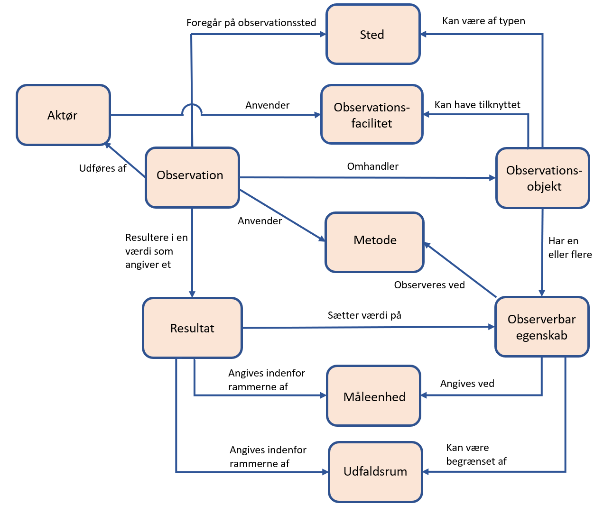

_Figur 11 - Overordnet konceptuel model med centrale forretningsbegreber._

### Anvendelse, tilpasning og udvidelse

Ved anvendelse af referencearkitekturen, vil det være op til anvenderen at tage stilling til hvor meget af referencearkitekturens model der anvendes på det specifikke område. Eksempelvis, i nogle situationer er det ikke er relevant at dokumentere oplysninger om selve stedet for en observation, hvor det i andre situationer vil være en helt central information at vide det sted hvor resultatet er fremfundet, eventuelt i hvilket miljø observation er målt. Her er nogle eksempler på spørgsmål, som anvenderen skal tage stilling til ved anvendelse af dette dokument og model:

* Hvilke forretningsobjekter er i fokus? Skal der observeres og måles på personer, vejret, trafikken, naturen, klimaet? Er det vigtigt at have oplysninger om observationsobjektet og hvilke?

* Hvilke metoder anvendes der? Findes der eksisterende metodebeskrivelser i kataloger som der kan refereres til? Hvilke oplysninger er vigtige at dokumentere om metoden?

* Skal der anvendes udstyr (observationsfacilitet) og hvilket? Hvilke informationer er i så fald vigtige at dokumentere om udstyret?

* Hvem kan foretage en observation? En medarbejder? Et apparat?

* Skal stedet for observationen redegøres for via fx en adresse eller en GPS-position mfl.?

I **Figur 12** er der til begrebsmodellens "røde kasser" tilføjet en række "grå kasser", som giver eksempler på "typer" af flere af de centrale forretningsobjekter i modellen. Figuren skal vise at det er op til det enkelte anvendelsesområde at udvælge de "typer" der er behov for at indarbejde i en anvendelsesmodel for anvendelsesområdet/projektet/løsningen.

Her kan det eksempelvis ses at "Stedet", hvor en observationsaktivitet finder sted kan angives og beskrives på mange forskellige måder, f.eks. som en adresse, en GPS-position eller noget tredje. Her er det op til projektet / anvendelsesområdet at tage stilling til, om det er vigtigt at vide noget om stedet - altså om det er noget der indsamles og registreres data om. I forlængelse heraf skal projektet / anvendelsesområdet tage stilling til, hvilke data som anvendes til at beskrive forhold om stedet. Er en adresse nok, eller kræves en mere præcis stedsangivelse i form af f.eks. en GPS-position.

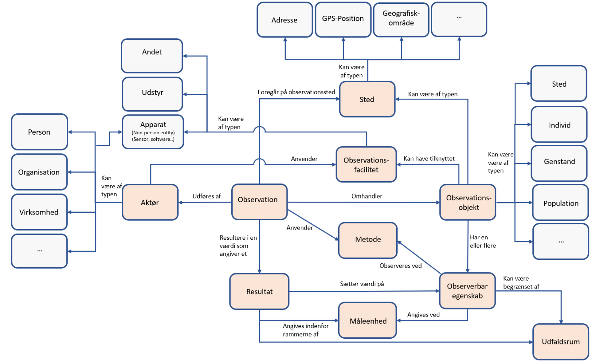

_Figur12 - Eksempel på udbygning af referencearkitekturens konceptuelle model med sted, aktør og observationsfacilitet._

### Logisk datamodel

I det følgende afsnit vil referencearkitekturens anvendelsesmodel, kort blive gennemgået. Anvendelsesmodellen er udformet som en [logisk datamodel](https://arkitektur.digst.dk/kom-i-gang/portefoelje/begreber/fda-ordbogen) jf. [de fællesoffentlige regler for begrebs- og datamodellering](https://arkitektur.digst.dk/metoder/regler-begrebs-og-datamodellering).

I dette afsnit vil modellen blive opdelt i mindre modelområder, hvor hvert område kortfattet vil blive gennemgået, og der vil blive givet forklaringer på specifikke detaljer inden for hvert område.

Gennemgangen vil være opdelt i følgende områder:

1. Område "Observationsobjekt"

2. Område "Observerbare egenskab"

3. Område "Observation og resultat"

4. Område "Observationsfacilitet"

5. Område "Sted"

6. Område "Aktør"

7. Område "Historik"

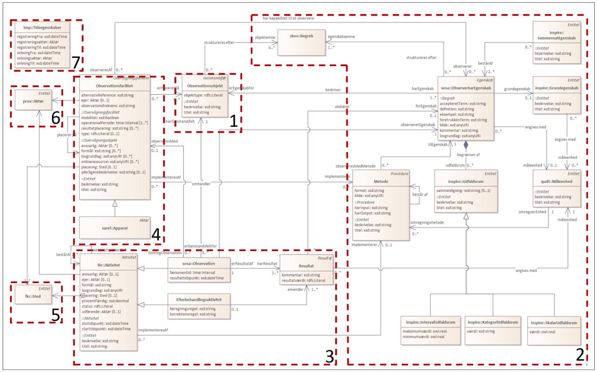

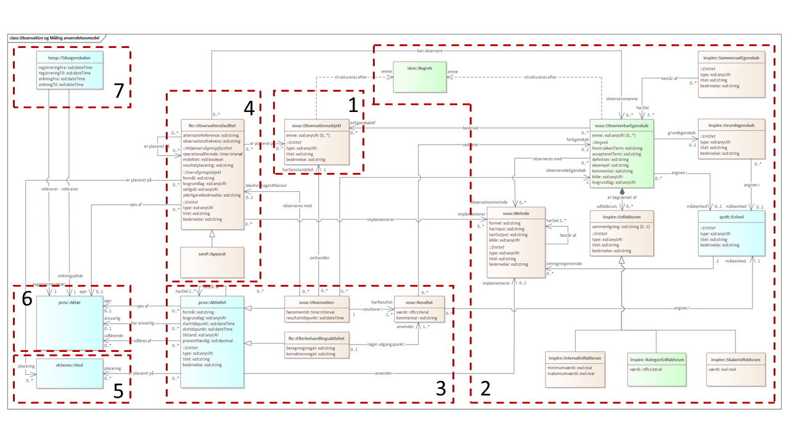

_Figur 13 - Oversigt over samlet anvendelsesmodel. De afgrænsede "stiplede områder" udgør de forskellige områder som kort vil blive gennemgået i de følgende afsnit._

Det vil ikke være alle detaljer i de forskellige områder, som bliver gennemgået i det følgende afsnit. Attributter og relationer mellem modelelementer kan der læses mere om i dokumentet [Anvendelsesmodel for observation og måling](https://data.gov.dk/model/profile/ObservationAndMeasurement/ObservationAndMeasurement.html). Der vil optræde en række begreber i form af modelelementer i de forskellige modelpakker, som ikke tidligere er defineret og beskrevet i nærværende dokumentet. Disse vil kort blive forklaret i det følgende afsnit.

#### 1\. Område "Observationsobjekt"

Observationsobjektet er det genstandsfelt, som er i fokus ved en observation, og det som man ønsker at blive klogere omkring. I forskellige fagligheder er det forskellige typer af observationsobjekter, der er i fokus. Da målet er, at anvendelsesmodellen kan anvendes generelt, er der i modellen heller ikke lagt en begrænsning ind i forhold til, hvilken type objekter der kan være i fokus ved en observation/måling.

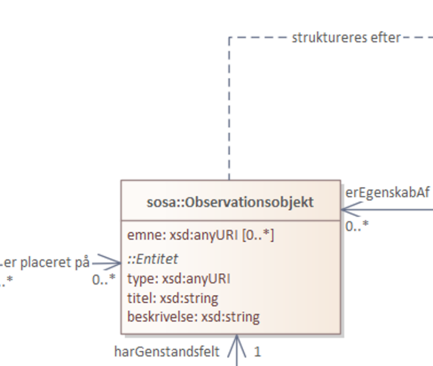

_Figur 14 - Område "observationsobjekt"_

Det vil være op til det enkelte projekt og fagområde at definere og beskrive de observationsobjekter, som er relevante lige præcis inden for deres område evt. i form af en klassifikation. Det vil derudover være forskelligt hvilke oplysninger der ønskes registeret og dokumenteret i en it-løsninger om selve observationsobjektet.

##### Eksempler på typer af observationsobjekter

Nedenstående afsnit giver eksempler på nogle af de overordnede typer af observationsobjekter som kan være genstandsfelt ved en observation/måling. Listen er ikke komplet og er blot for at illustrere forskellige typer af observationsobjekter. Det er som sagt op til det enkelte anvendelsesområde at definere observationsobjektet og beskrive eventuelle typer af observationsobjekter som findes indenfor netop dette anvendelsesområde. Modellen er åben for mere kompleks definition, afgrænsning og modellering af observationsobjektet, samt referencer til eksisterende observationsobjekter.

**Individ:** Et enkeltstående individ som genstandsfelt. Eksempelvis i form af et bestemt dyr eller en person. En borger og en patient kan begge være en type af "person", og de kunne dele nogle generelle observerbare egenskaber. Men det er netop vigtigt at tydeliggøre, at der også er nogle observerbare egenskaber som kun er vigtige i fx en sundhedsmæssig kontekst, og som kun observeres og måles ved typen patient. På samme måde kan der være specifikke egenskaber, som kun har interesse når observationsobjektet er defineret som en borger, f.eks. i forhold til en demokratisk eller demografisk kontekst. Definitionen af observationsobjektet er med til at sætte rammerne for hvilke observerbare egenskaber som er i fokus.

**Population:** Observationen/målingen kan også omhandle en gruppe af individer, som undersøges som en helhed. Det kan være en fugleflok, en skov, en befolkningsgruppe eller lignende. Her kan det fx være antallet af forskellige typer af individer eller egenskaber ved disse individer, der skal observeres.

**Sted:** Et geografisk sted kan være en adresse, et punkt i et koordinatsystem, eller et område (polygon) mfl. Inden for natur-, klima-, og miljøområdet er det ofte et sted ude i naturen som er genstandsfeltet, hvor man undersøger flere forhold omkring lige netop det sted. Her skal man være opmærksom på, at observationsobjekt og en observation kan relateres til et sted, men observationsobjektet kan altså også i sig selv være et sted, fx hvis man meget åbent stiller spørgsmålet "hvad sker der på dette sted?".                                                                                                   

**Proces og begivenhed:** En proces som observationsobjekt refererer til en trinvis eller gradvis sekvens af hændelser eller ændringer, der finder sted over tid. Denne proces kan have observerbare træk, der ændrer sig undervejs og kan kvantificeres eller beskrives ved hjælp af observationer og målinger.

En begivenhed som observationsobjekt er en specifik forekomst eller hændelse, der opstår på et bestemt tidspunkt eller i en specifik kontekst. Denne begivenhed kan have karakteristika der er interessante at observere, måle og dokumentere for at forstå begivenhedens natur og indflydelse.

#### 2\. Område "Observerbar Egenskab"

_**Figur** **15** viser det område af den samlede anvendelsesmodel, som omhandler Observerbare Egenskaber._

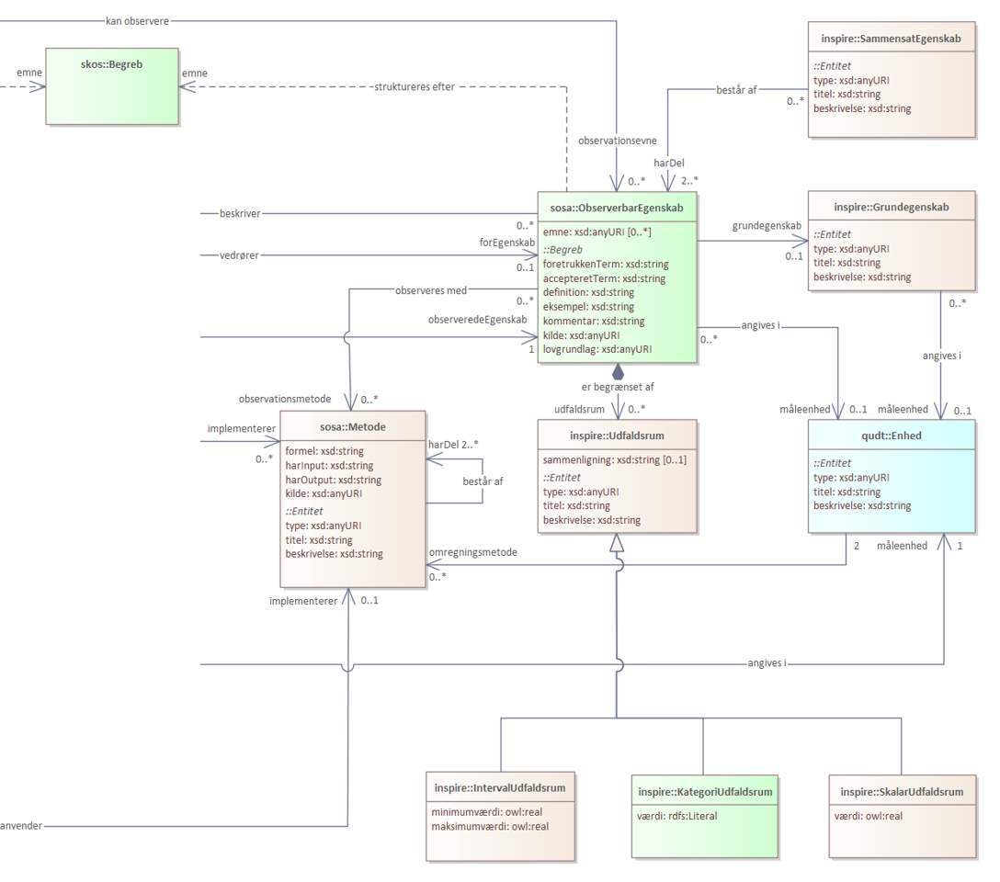

_Figur 15 - Område "Observerbar egenskab"_

##### Observerbar egenskab

Begrebet "Observerbar Egenskab" bliver udfoldet i dette område af modellen. Det er disse egenskaber, som er helt centrale at definere og beskrive, så det er klart og tydeligt, hvad der er i fokus for en observation og måling, og hvad det er man fremfinder resultater omkring. Det er i denne del af modellen, der sættes fokus på at arbejde struktureret med at definere og beskrive egenskabsklassifikationer, som kan deles og anvendes på tværs af mange parter. Læs mere om hvordan egenskaber kan beskrives og defineres i afsnit "[Definition og beskrivelse af observerbare egenskaber](#_Arbejdet_med_at)"

Udover at man selv kan definere og beskrive observerbare egenskaber, kan der også refereres til eksisterende referencer, hvor en observerbare egenskab er beskrevet, eksempelvis en international terminologi eller lignende.

Hver eneste observerbar egenskab som oprettes i et egenskabskatalog, kan yderligere tilkobles relevante udfaldsrum og målenheder, og struktureres efter en form for emneinddeling.

##### Enhed, Udfaldsrum og metode

Fælles for de tre begreber Enhed, Udfaldsrum og metode er, at de er med til at definere, hvad og hvordan vi kan observere og måle egenskaber ved observationsobjektet.

_**Enhed**_ angiver, hvad en observerbar egenskab måles i (eks. at "kropstemperatur" måles i grader celsius).

Mange måleenheder eksempelvis indenfor det naturvidenskabelige domæne vil allerede være defineret og beskrevet pr. konvention eller lov. Mange målenheder vil derfor kunne findes og genbruges fra eksisterende vokabularer eksempelvis den internationale [QUDT Units Vocabulary](https://qudt.org/2.1/vocab/unit). Dette vokabularium omfatter definitioner af måleenheder, deres symboler, dimensioner, enheder, konverteringsfaktorer og andre relaterede oplysninger, som gør det muligt for forskellige systemer at kommunikere og arbejde sammen på tværs af forskellige applikationer og domæner.

_**Udfaldsrum**_ angiver "begrænsninger" på de resultater som kan måles og observeres på en observerbar egenskab.

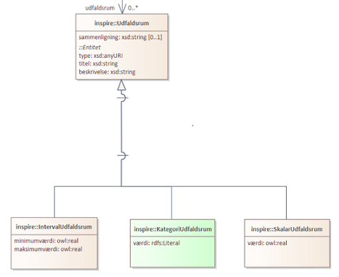

_Figur 16 – I anvendelsesmodellen bliver der defineret tre forskellige typer af udfaldsrum. Læs mere om forskellen på disse typer i modellen._

Dvs. at resultatet f.eks. skal ligge inden for et bestemt interval, følge en bestemt skala eller tilhøre en bestemt kategori. Udfaldsrum kan anvendes til at sætte regler og begrænsninger op for lovlige værdier af et resultat.

En observerbar egenskab kan godt have flere udfaldsrum, og på den måde kan modellen også anvendes til at definere normalintervaller, ofte også kaldet for referenceintervaller. Normalintervaller kan bruges til at udtrykke om det fremfundne resultat (værdi) for den givne observerbare egenskab er normal (hvis den ligger indenfor intervallet), eller anormal (typisk for høj eller lav) og dermed muligvis farlig, eller helt forkert, hvilket kunne pege på at der er sket en fejl ved observation/målingen. Se tabel 6 for eksempler på flere udfaldsrum for en observerbar egenskab.

_**Metode**_ kan være et centralt element ved anvendelse af denne referencearkitektur.

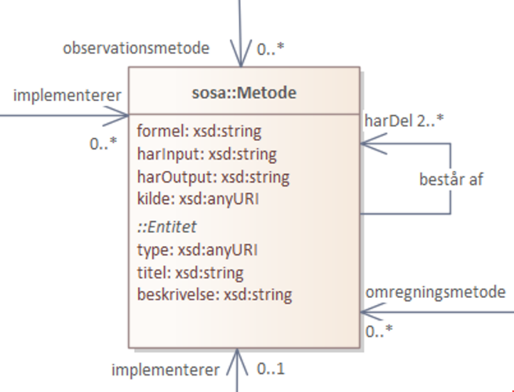

_Figur 17 - Beskrivelse af metode referencearkitekturen_

En metode kan anvendes til udpege den observerbare egenskab som der skal fremfindes resultat omkring, samt det udstyr som skal anvendes i denne proces. Metoden kan altså binde mange af de elementer sammen som optræder i referencearkitekturens anvendelsesmodel, og på denne måde sætte konteksten for hvordan en observation/måling skal foretages, samt de data som metoden kan resultere i.

Det vil være meget forskelligt fra anvendelseskontekst til anvendelseskontekst, hvor detaljeret et behov der vil være til at kunne redegøre for og beskrive den enkelte metode. Dette kan eksempelvis være på en forholdsvis ustruktureret måde ved hjælp af et fritekstfelt, der både redegør for formålet med metoden, samt beskrivelser af de handlingstrin der skal foretages for at fremfinde et korrekt resultat for en egenskab. Det kan også være på en mere struktureret form, hvor der oprettes flere felter til at beskrive metoden, herunder metodesetup og metodefremgangsmåde mfl. Dette kan være vigtigt hvis man ønsker at kunne redegøre for, om der har været foretaget fejl i metodesetup eller i fremgangsmåden for metoden, hvilket kan medføre til fejl i det resultat som fremfindes ved hjælp af metoden.

Det er også muligt at referere til allerede eksisterende metodebeskrivelser som kilde. Eksempelvis kan en metode være beskrevet i internationale terminologier, såsom [SNOMED CT terminologien](https://www.snomed.org/)[\[8\]](#fodnoter) på sundhedsområdet.

_Tabel 6 - Tabellen er et tænkt eksempel for hvordan den observerbare egenskab Blodsukker kan beskrives ved hjælp af modellen. Metode, enhed og udfaldsrum kan yderligere beskrives ved hjælp af modellen, med en række beskrivende felter, men er blot beskrevet simpelt med et felt i dette eksempel._

|                             |                                                                                                                                                                                                                                                                          |                                              |                                                        |
| --------------------------- | ------------------------------------------------------------------------------------------------------------------------------------------------------------------------------------------------------------------------------------------------------------------------ | -------------------------------------------- | ------------------------------------------------------ |
| **Observerbar egenskab**    |                                                                                                                                                                                                                                                                          |                                              |                                                        |
| **Fortrukken term**         | Blodsukker                                                                                                                                                                                                                                                               |                                              |                                                        |
| **Accepteret term**         | P-Glukose                                                                                                                                                                                                                                                                |                                              |                                                        |
| **Definition**              | Glukosekoncentration i blodet                                                                                                                                                                                                                                            |                                              |                                                        |
| **Kommentar**               | Blodsukker refererer til mængden af glukose (sukker) til stede i blodet på et givet tidspunkt. Det er en vigtig indikator for kroppens stofskifte og kan påvirkes af faktorer som kost, motion, hormoner og eventuelle medicinske tilstande.                             |                                              |                                                        |
| **Eksempel**                | En blodsukkermåling på 6.67 mmol/L indikerer, at der er 120 milligram glukose pr. deciliter blod.                                                                                                                                                                        |                                              |                                                        |
| **Emne**                    | Eksempelvis kan emnet være diabetes eller blod                                                                                                                                                                                                                           |                                              |                                                        |
| **Juridisk kilde**          | Eksempelvis link til relevant lovgivning på området                                                                                                                                                                                                                      |                                              |                                                        |
| **Kilde**                   | Eksempelvis link til yderligere information om hvordan blodsukker defineres og måles - [Blodsukkermålinger - Patienthåndbogen på sundhed.dk](https://www.sundhed.dk/borger/patienthaandbogen/hormoner-og-stofskifte/illustrationer/praesentationer/blodsukkermaalinger/) |                                              |                                                        |
| **Observeres med metode**   | Fingerstiks glukosemåler:  En populær og praktisk metode, hvor en lille mængde blod tages ved at stikke en finger med en lancet. Blodet påføres en teststrimmel, der indsættes i en glukosemåler, der beregner blodsukkerværdien.  Mfl.                      |                                              |                                                        |
| **Angives med enhed**       | millimol pr. liter (mmol/L)                                                                                                                                                                                                                                              |                                              |                                                        |
| **Begrænset af Udfaldsrum** | Minimumsinterval: Under 3.9 mmol/L                                                                                                                                                                                                                                       | Normalinterval:  Mellem 3.9-5.6 mmol/L | Øvre interval (efter måltider):  Over 7.8 mmol/L |

##### Strukturering af observerbare egenskaber

For at skabe strukturerede klassifikationer over observerbare egenskaber, er det nødvendigt at kunne kategorisere egenskaberne i forhold til hinanden. Denne kategorisering kan struktureres efter forskellige emner, eksempelvis kan emneinddelingen ske ift. de observationsobjekter der findes indenfor den pågældende anvendelseskontekst.

Det kunne eksempelvis være en liste af de observerbare egenskaber som bruges til at fortælle noget om forurening af luften fra biltrafik, som listes under emnet trafikalluftforurening.

Det er altså muligt at sammensætte observerbare egenskaber i kategorier, og en observerbar egenskab kan godt indgå i flere kategorier (emner).

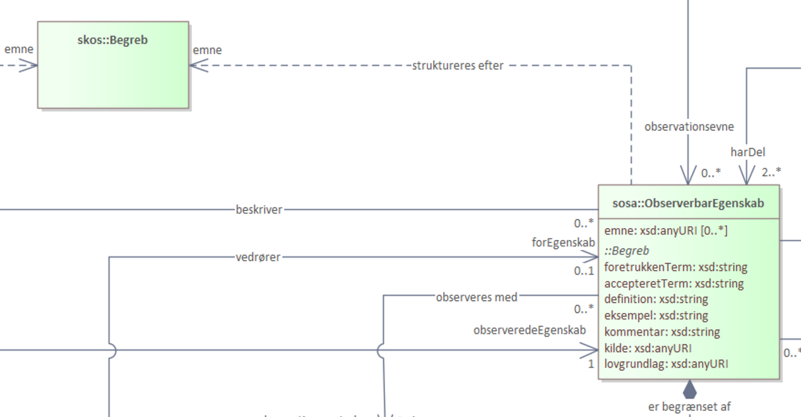

_Figur 18 - Observerbare egenskaber kan struktureres efter emner (relation mellem sosa::ObserverbarEgenskab og skos::Begreb i modellen). SKOS, eller Simple Knowledge Organization System, er en standard for organisering af viden og information ved hjælp af konceptuelle hierarkier og semantiske relationer._

##### Sammensatte egenskaber

Nogle gange "hænger" forskellige observerbare egenskaber sammen og giver nærmest kun mening i fællesskab. Eksempelvis giver det sjældent mening at måle vindhastighed uden også at angive retningen, så der kan med fordel oprettes en sammensat egenskab "Vindforhold", som består af de observerbare egenskaber "vindhastighed" og "Vindretning".

Et lidt mere "avanceret" eksempel på anvendelse af sammensatte egenskaber kan være en fiskeundersøgelse, hvor man efter at have taget nettet (eller nettene) op, skal redegøre for hvilke fisk der er fanget, defineret i arter, antal og længdeinterval.

Resultatet kunne se ud som i **Tabel 7**

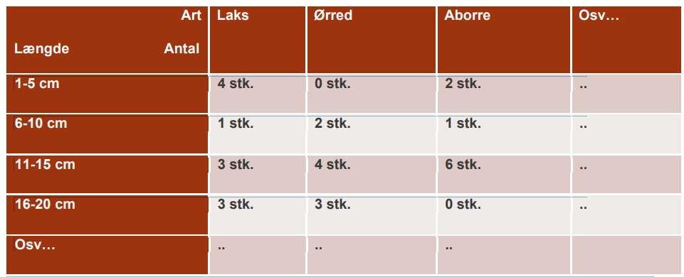

_Tabel 7 - Eksempel på hvordan fiskebestanden i en sø kan beskrives ved hjælp de observerbare egenskaber; fiskeart, længdeinterval og antal._

Den sammensatte egenskab, "Fiskebestand", består af 3 egenskaber:

1. "Fiskeart" med en kategoriudfaldsrummets artsliste for fisk (Her kunne det overvejes om det skulle være en "Ferskvandsfiskeart, men princippet er det samme).

2. "Længdeinterval" med en kategoriudfaldsrum: (1-5; 6-10; 11-15; 16-20, osv.) og måleenheden "cm"

3. "Antal" med et udfaldsrum om at den skal være >= 0 og måleenhed i "antal styk"

##### Grundegenskaber

Der findes en række observerbare egenskaber, som historisk er fastlagt i takt med den naturvidenskabelige udvikling. Denne række af observerbare egenskaber, kan der refereres til som "Grundegenskaber". Dette er egenskaber, som ofte gennem tiden er blevet veldefineret, velbeskrevet og fastlagt. Grundegenskaber kan ofte anvendes på mange forskellige fagområder.

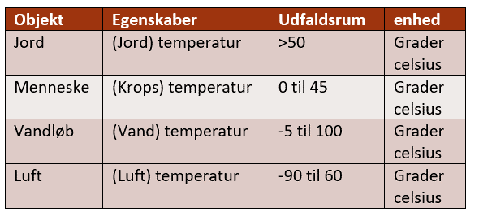

_Tabel 8 - Eksempler på observationsobjekter og deres tilhørende Observerbare egenskaber._

Her er egenskaben "Temperatur" et rigtig godt eksempel. Temperatur kan anvendes på mange fagområder til at fortælle om, hvordan noget tager sig ud på bestemt tidspunkt. Eksempelvis kan temperaturen i en menneskekrop måles, det samme kan ske i jordens atmosfære. En bestemt fødevare kan også have en temperatur, ligesom badevandet ved en strand kan angives ved en temperaturmåling. Måleenheden hvormed en temperatur angives kan variere (Celsius-, fahrenheit- og kelvinskala), ligesom udfaldsrummet kan være forskelligt alt efter, hvad man måler temperaturen på og formålet med målingen. Forståelsen af grundegenskaben "temperatur" er dog den samme på trods af forskellige enheder og udfaldsrum.

**Tabel** **8** viser hvordan det kan være relevant at definerer forskellige "temperaturegenskaber" for forskellige objekter.

##### Definition og beskrivelse af observerbare egenskaber

Arbejdet med at beskrive og strukturere observerbare egenskaber handler i høj grad om at få styr på de begreber som anvendes på et fagområde til, at beskrive hvad det er man ønsker at observere/måle om relevante observationsobjekter. Her kan en begrebsliste med fordel anvendes til at få styr på og beskrive relevante observerbare egenskaber. Som en del af referencearkitekturen er der udviklet en [skabelon](https://INDS%C3%86T%20LINK) til at beskrive observerbare egenskaber. Figur 19 viser hvordan en begrebsliste kan opbygges til at understøtte arbejdet med at definere og beskrive observerbare egenskaber. Begrebslisten er opbygget, så den tager hensyn til anvendelsesmodellens struktur af observerbare egenskaber, måleenheder, udfaldsrum og metoder. Derudover fungerer begrebslisten som en udvidelse og specialisering af [FDA's begrebsliste skabelon](https://arkitektur.digst.dk/metoder/begrebs-og-datametoder/regler-begrebs-og-datamodellering/vaerktoejsundersoettelse-af) opbygget efter [FDA's regler for begrebs- og datamodellering](https://arkitektur.digst.dk/metoder/regler-begrebs-og-datamodellering).

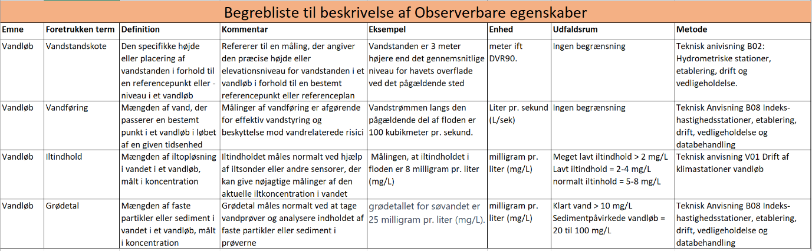

_Figur 19 - Eksempel på en udfyldt begrebsliste for observerbare egenskaber om et vandløbs hydrometri (måling og overvågning af vandets fysiske egenskaber samt parametre i vandmiljøet). Der er en række yderligere kolonner som kan udfyldes i begrebslisten, såsom kilde, disse kolonner er ikke medtaget i dette eksempel._

#### 3\. Område "Observation og resultat"

Observation og måling handler kort sagt om at udføre en eller flere konkrete handlinger for at fremfinde resultater om noget, som man ønsker at opnå viden om. Disse handlinger kan der, alt efter behov, redegøres for og dokumenteres data om. Modellen opsætter en fælles struktur og sprog for at beskrive observationer og andre aktiviteter.

Hvis der er flere aktiviteter/handlinger som til sammen udgør en observation/måling, kan disse hvis det er relevant struktureres ift. hinanden og samles i "pakker" for at vise, at de er del af en større opgave/proces.

Om de fleste observationer/målinger kan der være registeret et start- og sluttidspunkt, et velbeskrevet formål mfl., samt muligheden for at registrere hvilken aktør som eksempelvis har været ansvarlig for gennemførelsen af handlingen.

Modelelementet "Aktivitet" kan ligeledes anvendes som struktur til at beskrive andre handlinger som kan være relevante inden for et fagområde i forbindelse med observation og måling, det kunne fx være hvis man ønsker at redegøre for transporten af en prøve fra et sted til et andet.

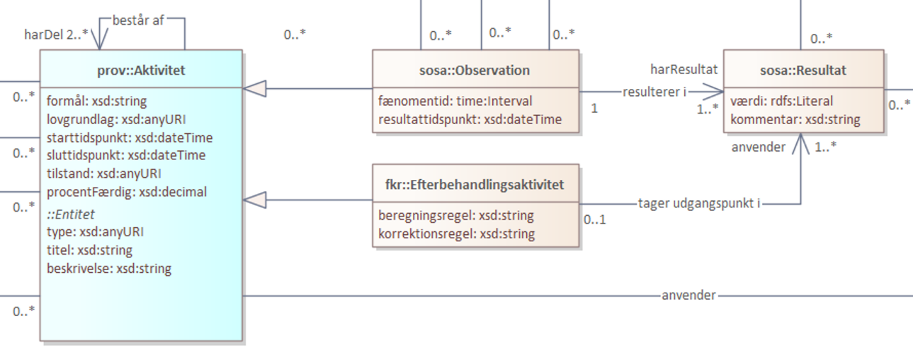

_Figur 20 - Område "Observation og resultat"_

##### Observation

Begrebet observationsaktivitet udgør et fælles overbegreb, for alle de typer af aktiviteter og handlinger, som kan udføres for at frembringe resultater. Det vil typisk være forskelligt hvilket begreb et fagområde anvender i deres daglige tale om den handling som fremfinder resultater. Begreber såsom undersøgelse, måling, prøvetagning, udredning mfl. vil være synonymer til begrebet observation.

##### Resultat efterbehandling

"Resultat efterbehandling" er en handling, som tager udgangspunkt i allerede fremfundne og kendte resultater, for at anvende disse til at fremfinde nye resultater. Udregning af en persons BMI (Body Mass Index) er godt eksempel på en efterbehandling af allerede fremfundne resultater, da det kræver at personens vægt og højde kendes for at udregne personens BMI. Begreber såsom beregning, analyse, korrektion mfl. er eksempler på handlinger som tager nogle kendte resultater og bruger disse til at fremfinde nye resultater, og vil ofte anvendes som mere forretningsnære begreber for den type af handling som en "resultat efterbehandling" er.

##### Samling af observationer

En aktivitetspakke defineres som en samling af aktiviteter med fælles overordnet formål. Observationer (aktiviteter) kan sammensættes efter behov i "pakker".

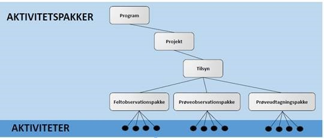

*Figur 21- Eksempel på samling af aktiviteter (eksempelvis observationer) i "pakker"*

En samling af flere aktiviteter kan på denne måde anvendes i modellen til at redegøre for de forretningsopgaver som udføres på et forretningsområde, og kan således dække forretningsnære begreber såsom tilsyn, program, projekt mfl. På denne måde er det muligt på en generaliseret måde at beskrive de handlinger/aktiviteter på mange forskellige niveauer og i mange forskellige kontekster.

**Figur** **20** viser et eksempel på, hvordan man kan samle aktiviteter i pakker. Her er der tale om et større program, der indeholder et projekt, der indeholder en opgave Tilsyn, der er nedbrudt i tre specialiserede observationspakker, der igen hver især indeholder en række konkrete aktiviteter.

Det vil afhænge af det pågældende fagområde, projekt, it-løsning osv., i hvor høj grad, og hvor præcist der er behov for at angive og dokumentere oplysninger om selve aktiviteten i en it-løsning. Eksempelvis om der er behov for at dokumenterere hvilket sted og hvilken aktør, som har udført aktiviteten.

##### Resultat

Et resultat fortæller noget om, hvordan det objekt og de egenskaber, som undersøges, tager sig ud på konkrete tidspunkter. Et resultat kan være en talværdi, men kan også antage mere komplekse former som tal-sæt, grafer, vektorer, ord, sætninger og lign.

Et resultat giver kun mening i en konktest, hvis man kender den måleenhed resultatværdien er angivet med, hvorfor det er en vigtig del af dokumentationen. Et resultat er tætknyttet til den observation/måling som er det fremfundne resultatet, og et resultat vil ofte ikke give meget forretningsværdi, hvis ikke man ved hvordan resultat er opstået, og eksempelvis hvilken aktør der har fremfundet resultatet.

_Figur 22 – Sammenhæng mellem observation og resultat._

##### Simple resultater

Den simple model sætter 1 værdi på 1 egenskab ved hjælp af 1 observation. 

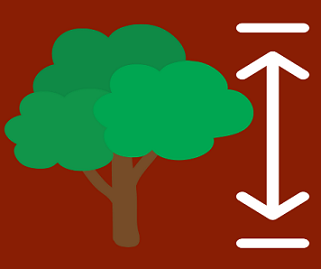

Eksempelvis er højden af træet (observerbar egenskab) = 8,2 (resultatværdi) meter (målenhed), målt den 17/4/2018 kl. 9.25 (tidspunkt for observation). Den anvendte metode - Triangulering angives gennem observationen.

##### Komplekse resultater

Afhængigt at den kontekst modellen anvendes i, kan der anvendes mere komplekse resultater som følge af én observation. I det simple eksempel nedenfor redegøres for tidspunkt, sted, aktører og lignende for hver observation, som giver et resultat, men en observation kan også strække sig over længere tid og give flere resultater over tid.

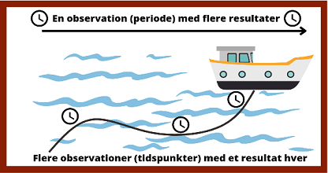

I dette eksempel sejler et skib med et måleudstyr, som tager en måling hvert 5. minut. Det kunne dokumenteres, som en lang række observationer - en for hver måling, som giver et resultat hver gang. Men det kan også dokumenteres som én observation, som strækker sig fra, skibet begynder sin rute til den er færdig, med et resultat hvert 5. minut.

Metoden med at angive mange resultater over tid i én observation er et godt eksempel på en tidsserie.

Her er et eksempel på en tidsserie med angivelse af tidspunkter med dertilhørende resultat (format tt:mmd,resultat;): 14:00,17; 14:05,13; 14:10,15; 14:15,17; - osv.

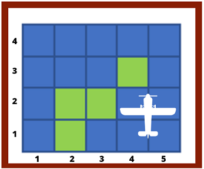

Her er et andet eksempel, hvor en vandoverflade er inddelt i kvadranter og ved overflyvning angives vandets farve (grøn eller blå). Resultaterne kan her angives som en række alfanumeriske værdier, som giver en værdi for hvert kvadrat (format: b,b:farve): 1,1:blå; 1,2:blå; … 2,4:grøn; 2,5:blå - osv.

#### 4\. Område "Observationsfacilitet"

I forbindelse med en observation eller måling, vil der ofte anvendes en eller anden form for "udstyr" til at frembringe de ønskede observations- og måleresultater.

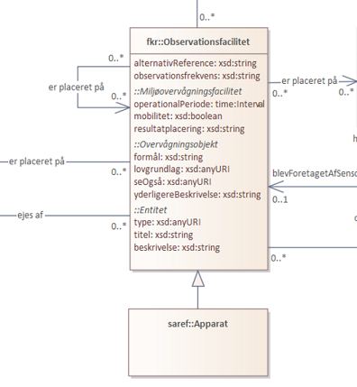

_Figur 23 – Område ”Observationsfacilitet”_

Udstyr spiller en afgørende rolle i hele processen med observation og måling, da det ofte er det, der direkte interagerer med det emne, der observeres, og indsamler information om det.

En observationsfacilitet kan være mange ting (forskellige typer af udstyr), og det vil være meget forskelligt fra anvendelsesområde til anvendelsesområde, hvilket udstyr der anvendes, og i hvor høj grad det er centralt at kunne redegøre for det udstyr (oplysninger om udstyret) som anvendes til at fremfinde resultater.

Nogle gange er det ikke det konkrete stykke udstyr, der dokumenteres, men blot typen af udstyr. I andre tilfælde er det vigtigt at kunne redegøre for, at det er præcis den måler med det serienummer, der er anvendt. Måske findes der senere en måleunøjagtighed i udstyret, som tidligere målinger skal korrigeres for.

En observationsfacilitet kan medbringes og anvendes i en given situation. Det kan også være placeret på et bestemt sted ude i naturen i længere tid, eller i nogle tilfælde på et specifikt individ (observationsobjekt) eller et andet stykke udstyr. Eksempelvis i form af en måler, som kontinuerligt måler vandstanden i et vandløb, eller en GPS- enhed som rapporterer et givent dyrs færden ude i naturen.

##### Apparat

Apparater er en særlig type af observationsfacilitet, som er en fysisk konstruktion med indlejret software, som typisk har en eller flere fast indbyggede funktioner. Et apparat kan på denne måde være et stykke udstyr, som kan foretage observationer/målinger - eksempelvis en sensor eller en sonde. Et apparat kan opsættes til selv at kunne foretage og udføre målinger, med en specifik frekvens i en specifik tidsperiode. Et apparat kan agere som aktør, og optræde med sin egen identitet.

##### Kalibrering og konfiguration af udstyr og dataoverførsel

_Observationsudstyr kan kræve konfiguration og kalibrering for at sikre nøjagtighed og pålidelighed af de data som indsamles. Konfigurering og kalibrering betyder overordnet at justere udstyret, så det giver præcise måleresultater i forhold til kendte standarder. I referencearkitekturen lægges der op til at udstyr konfigureres og kalibreres efter metoder og observerbare egenskaber som kan defineres og beskrives ved hjælp af denne referencearkitektur._ I nogle fagligheder er der behov for at dokumentere hvilket udstyr, der kan anvendes til at måle hvad. Dette kan der redegøres for via relationen "har Kapabilitet Til At Observere" mellem observationsfacilitet og observerbar egenskab. På den måde kan man få en udstyrsliste i forbindelse med planlægningen af bestemte målinger.

_Udstyr som anvender proprietærer standarder til at gemme og strukturerer data, kan konfigureres til at overføre data til centrale databaser efter referencearkitekturens anvendelsesmodel, så de gemmes i rette ensartede format._

##### Identifikation af udstyr

Inden for nogle forretningsområder kan det være lovgivningsmæssige krav til opmærkning/identifikation af udstyr, som vil være tilføjelser til den nuværende anvendelsesmodel ikke tager hensyn til. Eksempelvis stiller EU's Forordning om Medicinsk Udstyr ([Medical Device Regulation - MDR](https://www.ds.dk/da/om-standarder/ce-maerkning/produktgrupper/medicinsk-udstyr?gad_source=1&gclid=Cj0KCQiAmNeqBhD4ARIsADsYfTc6YMKEmXy2G_5wK_hvPvz4vhnH_f2iTOYPw4t_K6vZbZLmJVmOfF4aAlv3EALw_wcB)) krav til at medicinsk udstyr identificeres med en unik enhedsidentifikator (Unique Device Identifier - UDI). UDI'en består normalt af [GTIN](https://www.gs1.dk/services/gtin) (Global Trade Item Number), serienumre, batchnumre eller andre specifikke identifikatorer for at muliggøre entydig identifikation af hvert stykke udstyr. Herudover er der en række andre krav til oplysninger om udstyrets navn, producent, produktionsdato mfl. som det er et krav at der registreres oplysninger om for alt medicinsk udstyr.

#### 5\. Område "Sted"

##### Sted

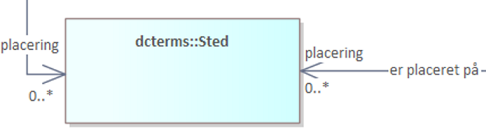

_Figur 24 – Område ”sted” i anvendelsesmodellen_

_Sted repræsenterer behovet for at kunne angive hvor en observation og målinger finder sted._ Stedet kan redegøres for på forskellige måder alt efter behov. Et sted kan være både det sted observationen foregår, samt være selve målet for en observation og måling, hvilket vil sige at det altså er lige præcis det sted som der ønskes at indsamles data omkring

**"Stedet" som genstand for observationen/målingen**

Her refererer "sted" til det specifikke geografiske område eller lokalitet som er genstand og mål for selve udførelsen af en observation og måling. Eksempelvis kunne et scenarie være at nogle forskere ønsker at måle temperaturvariationer på forskellige steder i en skov. Hvert af disse steder repræsenterer forskellige positioner i skoven, hvor temperaturen varierer baseret på faktorer som eksponering for sollys, højde over havets overflade, tilstedeværelsen af vandløb osv. Så i denne sammenhæng er "sted" de konkrete områder, som er interessante at indsamle data omkring. Selve stedet bliver altså det der indsamles data omkring.

**"Stedet" som det sted, hvor observationen/målingen foretages**

I dette tilfælde refererer "sted" til den position, hvor en aktør fysisk befinder sig mens der udføres en observation/måling. Her selve stedet ikke målet for observationen/målingen, men skal mere ses som en referenceangivelse af hvor en observation/måling er foretaget.

##### Eksempler på typer af steder

Nedenstående liste er en række eksempler på hvordan man kan angive et sted. Listen er ikke komplet og er blot tiltænkt som eksempler. Det vil være op til det enkelte anvendelsesområde at definere behovet til at redegøre oplysninger om steder.

**Det geografiske sted:** Et sted kan angives som et afgrænset geografisk eller rummeligt område. Dette område kan eksempelvis beskrives som et punkt eller en position (fx GPS-koordinat), en flade (fx afgrænset område i landskabet), en linje (fx en vejmidte), et tredimensionelt område med højde (fx en brønd) eller et multiobjekt, der kombinerer flere forskellige typer. Hvis stedet i forvejen kendt, kan "området" formodentligt være oprettet som et GeoDanmarkObjekt med en eventuel titel eller navn i GIS-løsninger.

**Geoobjekter og stednavne:** Et sted kan ligeledes angives ved hjælp af et GeoDanmarkObjekt. Et GeoDanmarkObjekt er stedfæstelsen af forskellige kendte geoobjekter i Danmark. Et GeoDanmarkObjekter kan være af forskellige typer, eksempelvis en vej, en bymidte, en skov. I Danmark er det muligt at angive "kendte" GeoObjekter i form af navngivne steder, som eksempelvis kan være "Bagsværd sø", "Rådhuspladsen" eller "Ejer Bavnehøj". Læs mere om GeoDanmarkObjekter i GeoDanmark Specifikationen[\[9\]](#fodnoter) De vil være oprettet som et GeoDanmarkObjekt og have en entydig ID.

**Adresser:** Et sted kan angives ved hjælp af en adresse, hvis en sådan findes, der hvor en observation/måling foretages.

##### Eksempler på internationale standarder på området

Der eksisterer en lang række internationale standarder som supplerende kan anvendes til opnå korrekt identifikation af det sted, hvor en observation/måling er foretaget. De internationale standarder definerer ofte metoder og terminologi til at beskrive disse steder ensartet.

ISO har eksempelvis udviklet en række standarder som på forskelligvis beskriver steder, herunder ISO [19112 - Spatial Referencing by Coordinates](https://www.iso.org/standard/70742.html), [ISO 19115 - Geographic Information - Metadata](https://www.iso.org/standard/53798.html) mfl.

Herudover kan et andet eksempel være den internationale GS1 standard [GLN (Global Location Number),](https://www.gs1.dk/services/gln) som kan anvendes til identifikation af observations-/målesteder. GLN kan tildeles til specifikke steder, hvor observationer foretages, såsom laboratorier, sensorplaceringer, målestationer, eller enhver fysisk lokation, hvor data indsamles. Hvert sted, der bruges til observation eller måling, kan tildeles et unikt GLN. Dette muliggør en entydig identifikation af hvert sted og gør det nemmere at spore og organisere data fra forskellige lokationer.

#### 6\. Område "Aktør"

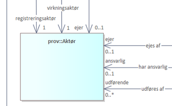

_Figur 25 - Område "Aktør" i anvendelsesmodellen_

I forbindelse med en observation/måling vil det ofte være relevante at kunne beskrive og dokumenterer oplysninger om den eller de aktører som har haft en rolle ifm. udførelsen af observationen/målingen. I denne referencearkitektur er aktører ofte dem som foretager selve observationen/målingen eller har ansvaret for udførelsen. "Aktør" skal anvendes til at identificere og beskrive de typer af aktører der er relevante indenfor det specifikke forretningsområde, samt hvilke informationer om aktørerne der ønskes registeret og dokumenteret data om i en it-løsning.

##### Aktørens betydning for kvaliteten og pålideligheden af data

På mange forretningsområder spiller aktøren en afgørende rolle ift. at kunne sige noget om kvaliteten og pålideligheden af de data der indsamles ved en observation/måling. Indenfor sundhedsområdet kan det eksempelvis have stor betydning for brugen af data, om borgeren eksempelvis selv har indsamlet data om deres helbred via en App, eller om data er indsamlet af en sundhedsprofessionel i de rette rammer. Det kan være forskelligt hvilke kompetencer forskellige aktører har ift. deres evner til at følge korrekte procedurer, kalibrere udstyr korrekt og træffe relevante beslutninger under observation/måling. Alt sammen noget der kan være med til at påvirke kvaliteten og pålideligheden af de data som indsamles.

##### Eksempler på typer af aktører

Aktører kan være personer, enheder eller systemer, der er ansvarlige for at udføre observationer og målinger. Dette kan omfatte forskere, teknikere, sensorer, automatiserede systemer osv. Aktørerne er ofte dem, der er direkte involveret i indsamlingen af data.

Nedenstående liste er en række eksempler på forskellige typer af aktører. Listen er ikke komplet og er blot tiltænkt som eksempler. Det vil være op til det enkelte anvendelsesområde at identificere og beskrive relevante typer aktører for lige netop deres anvendelseskontekst.

**Menneskelige aktører:** Forskere, medarbejdere eller andet der udfører observationer og målinger som en del af deres arbejde. Oplysninger om disse kunne omfatte eksempelvis omfatte navn, medarbejder ID mfl.

**Apparater:** Automatiserede sensorer eller instrumenter, der er designet til at indsamle data fra det omgivende miljø. Dette kunne omfatte temperatursensorer, luftfugtighedssensorer, tryksensorer osv. Kan også være droner, robotter eller andet som kan indsamle data der måske er vanskelige for mennesker at nå. Det kan også være dataloggere som gemmer data over tid, ofte i områder hvor der ikke er konstant menneskelig overvågning.

**Softwareapplikationer:** Programmer, der styrer og koordinerer processen med at indsamle, organisere og præsentere data. Dette kunne omfatte dataopsamlingssoftware, analyseværktøjer osv.

#### 7\. Område "Historik"

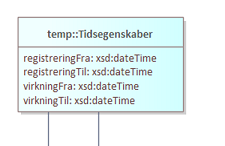

_Figur 26 - Område "Historik" i anvendelsesmodellen_

Dette afsnit omhandler historik som kan være en vigtig funktion, der kan anvendes i en IT-løsning til at registrere og spore ændringer. Det kan især være relevant ift. metadata vedrørende observerbare egenskaber, enheder, metoder, osv.

Observerbare egenskaber kan variere over tid og udvikle sig, og det er her vigtigt at kunne få adgang til tidligere beskrivelser, især når man ønsker at sammenligne resultater, der er indsamlet på forskellige tidspunkter. Dette er særligt vigtigt, når beskrivelsen af den observerbare egenskab har ændret sig markant, da historikken muliggør en sådan sammenligning.

Historik er vigtig, fordi den hjælper med at opretholde datakvalitet og sporbarhed over tid. Det sikrer, at ændringer i data og beskrivelser dokumenteres og muliggør sammenligning af data på forskellige tidspunkter. Dette er afgørende for dataintegritet, troværdighed, samt ift. efterlevelse af regler for dokumentation af data og metadata.

## Applikation

I dette kapitel beskrives tekniske og praktiske forhold, der er relevante for realisering af forretningsfunktioner og mønstre for observation og måling. Der gives en række eksempler på implementeringsmønstre som på forskellige vis kan håndtere opgaver og behov relateret til at indsamle, behandle og dele observerbare og målbare data.

Dette afsnit omhandler historik som kan være en vigtig funktion, der kan anvendes i en IT-løsning til at registrere og spore ændringer, især i metadata vedrørende observerbare egenskaber, enheder, metoder, osv. Observerbare egenskaber kan variere over tid og udvikle sig, og det er her vigtigt at kunne få adgang til tidligere beskrivelser, især når man ønsker at sammenligne resultater, der er indsamlet på forskellige tidspunkter. Dette er særligt vigtigt, når beskrivelsen af den observerbare egenskab har ændret sig markant, da historikken muliggør en sådan sammenligning.

### Centrale applikationskomponenter

I dette kapitel præsenteres en række generelle applikationskomponenter som er centrale ift. at forstå de forskellige implementeringsmønstre af et egenskabskatalog som præsenteres i kapitlet.

**Tabel 9** på næste side lister eksempler på centrale applikationskomponenter med en tilhørende kort beskrivelse.

_Tabel 9 - Liste med beskrivelser af centrale komponenter til at understøtte anvendelse af et egenskabskatalog_

|                                                                                                             |                                                                                                                                                                                                                                                                                                                                                                                                                                                                                                                                                           |
| ----------------------------------------------------------------------------------------------------------- | --------------------------------------------------------------------------------------------------------------------------------------------------------------------------------------------------------------------------------------------------------------------------------------------------------------------------------------------------------------------------------------------------------------------------------------------------------------------------------------------------------------------------------------------------------- |
| **Komponent: Egenskabskatalog**  ****        | **Komponent til at definere/beskrive referencedata (Egenskabsklassifikationer)**  Komponent som understøtter udformning og administration af egne egenskabsklassifikationer. Komponenten kan ligeledes anvendes til at indlæse eksisterende fælles klassifikationer samt at stille klassifikationerne til rådighed for andre komponenter (løsninger).                                                                                                                                                                                               |
| **Komponent: Måleudstyr/målesoftware**  **** | **Komponent som kan foretage observationer/ målinger, og som kan konfigureres til af indsamle data efter standard/metode**  Komponent, ofte i form af et teknisk apparat, som kan indsamle observations- og måledata. Komponenten kan konfigureres, fx hos leverandøren, af en specialist hos forretningen eller af en slutbruger, fx borgeren selv. Anvendelse af komponenten til observation og måling kan kræve oplæring af registranten, så komponenten anvendes korrekt.  Komponenten kan konfigureres efter en egenskabsklassifikation. |
| **Komponent: Indberetningssoftware**  ****   | **Komponent til indberetning (registrering/dokumentation) af måle/observationsdata**  Softwareløsning, der anvendes til at indsamle og registrere data fra måleudstyr eller andre type af udstyr eller software til datafangst.  Et indberetningssoftware kan fx være en del af funktionaliteten i et medarbejdervendt fagsystem, en borgervendt selvbetjeningsløsning eller en app.                                                                                                                                                          |
| **Komponent:** **Lager/indeks**  ****        | **Komponent til lagring af data fra flere kilder i fælles repository / registry**  Løsning der samler data fra flere datakilder, enten som lager med forretnings-/transaktionsdata (repository) eller indeks med metadata om forretnings-/transaktionsdata (registry).                                                                                                                                                                                                                                                                              |
| **Komponent: Databehandlingssoftware**  **** | **Komponent til klargøring af data til anvendelse (transformation)**  Løsning der behandler og klargør data til forretningsmæssig anvendelse.  En slags middleware eller støttesystem. Det kan fx være ved at indhente, samle, sammenstille og transformer data, på en måde der understøtter et konkret behov i et slutbrugervendt anvendelsessystem. Komponenten kan anvende egenskabsklassifikation som standard til at transformere data.                                                                                                  |
| **Komponent:** **Anvendelsessystem**  ****   | **Komponent til visning og anvendelse af data**  Løsning der anvender (observations og måle) data til et forretningsmæssigt formål.  Det kan fx være et medarbejdervendt fagsystem, eller et apparat/robotsystem eller et borgervendt selvbetjeningssystem / app.                                                                                                                                                                                                                                                                             |

### Implementeringsmønstre

I dette afsnit er beskrevet og vist fire overordnede implementeringsmønstre, som viser hvordan egenskabskataloget kan understøtte ensartet indsamling fra en eller flere kilder, samt behandling og transformation af data fra proprietærer kilder.

#### 1\. Indsamling fra en kilde og direkte anvendelse af data i anvendelsessystem

Dette implementeringsmønster redegør for en helt simpel model, hvor forretningsdata indsamles i standardformat ved hjælp af et stykke måleudstyr/målesoftware.

Måleudstyret er i dette mønster konfigureret så det opsamler data efter definerede og beskrevne "standarder" som findes i egenskabskataloget. Forretningsdata anvendes efterfølgende som det er indsamlet, direkte i anvendelsessystemet. Scenariet kunne også have været at data blev indsamlet i proprietærformat hvis måleudstyret ikke var konfigureret efter egenskabskataloget.

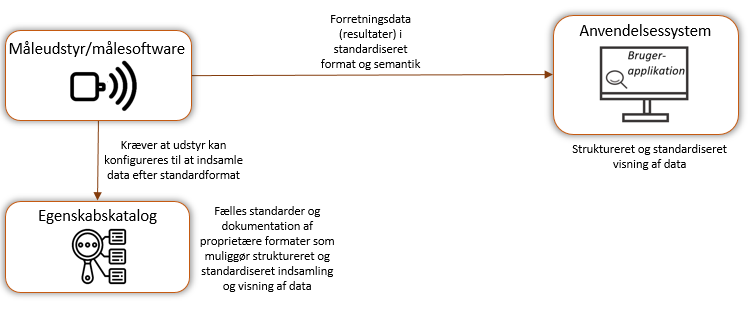

_Figur 27 - Illustration af Implementeringsmønster: Indsamling fra en kilde og direkte anvendelse af data i anvendelsessystem_

Måleudstyret/målesoftwaren skal i dette implementeringsscenarie kunne konfigureres til at måle og indsamle data i det format og efter den semantik, der er defineret i egenskabskataloget. Ved indkøb af nyt måleudstyr, skal der stilles krav til at leverandørens udstyr enten konfigureres eller udvikles så det måler efter aftalt format, eller stilles krav til at udstyret kan konfigureres af brugeren selv, så det overholder aftalt format og semantik. Konfigurationen kan ske manuelt eller automatisk via egenskabskataloget.

#### 2\. Indsamling fra forskellige kilder og direkte anvendelse af data i anvendelsessystem

Dette implementeringsmønster redegør for en model hvor data indsamles fra flere forskellige kilder. Data kan være indsamlet af noget måle udstyr, eller være registeret af en menneskelig registrant i et stykke måle/indberetningssoftware.

Både måleudstyr og målesoftware og registranten er understøttet af fælles metoder og standarder fra egenskabskataloget, som sikrer at forretningsdata indsamles indenfor fælles aftalerammer, eksempelvis kunne man forstille sig at softwaren som registranten anvender, kun stiller få felter til rådighed, med fast definerede udfaldsrum som kan udfyldes af registranten, hvilket sikrer en ensartet dokumentations- og registreringspraksis. Data anvendes herefter direkte i et anvendelsessystem hvor data kan harmoniseres og præsenteres struktureret efter fælles standard og struktur jf. egenskabskataloget. Dette scenarie kræver igen at både måleudstyr/software og indberetningssoftware enten er konfigureret fra leverandørens side, eller kan konfigureres af brugeren så det anvender "standarderne" fra egenskabskataloget.

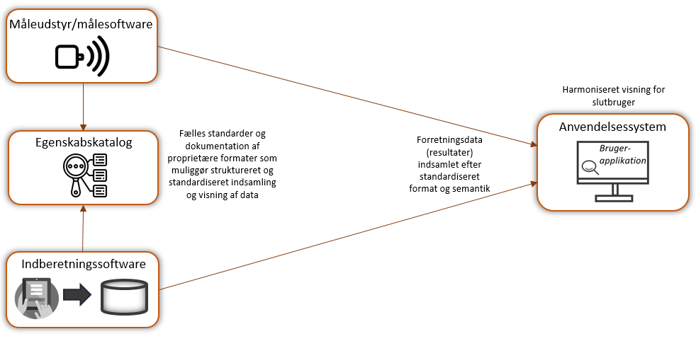

_Figur 28 - Illustration af Implementeringsmønster: Indsamling fra forskellige kilder og direkte anvendelse af data i anvendelsessystem_

#### 3\. Indsamling fra forskellige kilder og behandling af data før anvendelse i anvendelsessystem

Dette implementeringsmønster understøtter scenarier hvor forretningsdata indsamles fra forskellige kilder i proprietærformat. Data bliver her transformeret igennem databehandlingssoftware som "oversætter" data efter metoder og klassifikationer i egenskabskataloget før det ender hos slutbrugeren. På denne måde kan data fra flere kilder harmoniseres og efterfølgende anvendes i et anvendelsessystem. Dette scenarie vil oftest være relevant i en situation, hvor der eksempelvis indkøbes måleudstyr og software fra flere leverandører, hvor udstyret leveres med proprietærer dataformater, som enten afleverer data i et forkert format, eller i flere forskellige formater.

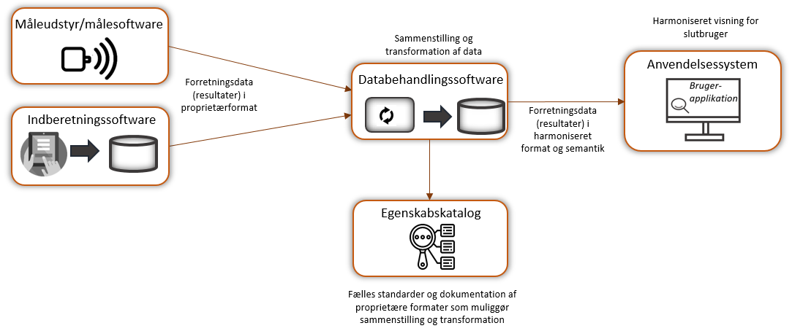

_Figur 29 - Illustration af Implementeringsmønster: Indsamling fra forskellige kilder og behandling af data før anvendelse i anvendelsessystem_

#### 4\. Indsamling fra forskellige kilder, fælles lagring og transformation af data før anvendelse i af anvendelsessystemer

I dette implementeringsmønster indsamles forretningsdata via mange forskellige kilder i proprietærformat. Data lagres efterfølgende i fælles lager eller indeks, som kan transformere og harmonisere data ved hjælp af databehandlingssoftware som følger metoder og klassifikationer i egenskabskataloget. Herefter udstilles data i det fælles lager/indeks som flere anvendelsessystemer kan tilgå, og efterfølgende vise data harmoniseret efter slutbrugernes behov.

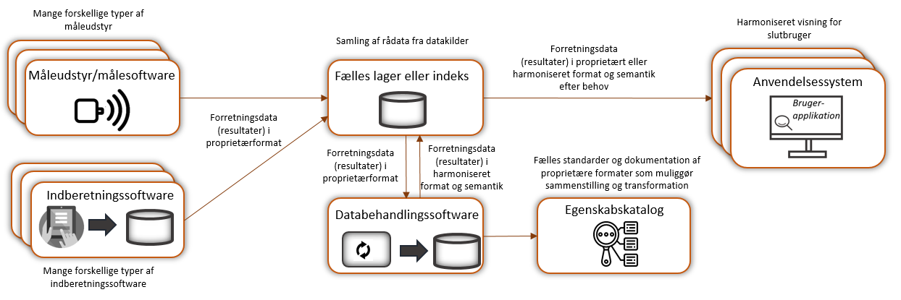

_Figur 30 - Illustration af Implementeringsmønster: Indsamling fra forskellige kilder, fælles lagring og transformation af data før anvendelse af flere anvendelsessystemer_

### Implementering af egenskabskatalog

Referencearkitekturen giver ikke direkte anvisninger på, hvordan anvendelsesmodellen implementeres som fysisk kode, men der er en række forhold, man bør tage hensyn til, for at modellen fungerer efter hensigten, og man opnår de fordele, som anvendelsesmodellen giver mulighed for i form af et egenskabskatalog.

Derfor er der herunder en række anbefalinger til det programmel, som udvikles til at opsamle observations- og måleresultater, samt anbefalinger til modellens anvendelse i forbindelse med udveksling af data i et eksisterende it-miljø.

### Egenskabskataloget som selvstændig klassifikationskomponent

Egenskabskataloget bør bygges som en selvstændig og systemuafhængig komponent, da det giver stor forretningsværdi at have et konsolideret og autoritativt katalog med veldefinererede klassifikationer for egenskaber, som er fri af systemmæssige afhængigheder. På denne måde kan man opnå fleksible løsninger, hvor kataloget kan anvendes af en eller flere it-løsninger/komponenter, samt undgå at meget af den faglige forretningsviden er "låst" til det konkrete it-løsning. Egenskabskataloget vil være omdrejningspunkt for den forretningsmæssige forståelse.

Den eller de it-løsninger som har til formål at registrere resultaterne som indsamles, bør bygges robust ift. "faglige" ændringer i den eller de egenskabsklassifikationer som avendes. Det gælder både ift. ændringer i eksisterende egenskaber og tilføjelse af nye. Konkret betyder dette, at der ikke skal ændres i koden, hvis de observerbare egenskaber i kataloget ændres, eller der kommer flere til. Det er centralt at it-løsningen følger egenskabskatalogets opbygning, hvad angår betegnelser, måleenheder, udfaldsrum og metoder.

Der bør bygges **historik**\-egenskaber ind i egenskabskataloget. Kun på den måde, kan man se, hvad der var gældende for en observation tilbage i tid og forholde sig til, hvordan den observerbare egenskab så ud på det tidspunkt, den blev foretaget.

### Egenskabskataloget som fælles løsning

Egenskabskataloget kan ligeledes bygges som en fælles løsning, hvor flere aktører har adgang til klassifikationer og kan bidrage med klassifikationer.

Et sådant katalog bør være åbent og kunne tilgås af relevante parter, både i form af en brugervendt webgrænseflade, men også i form af snitflader, så udviklere kan tilgå kataloget ift. videre udvikling, samt abonnere på opdateringer og nye versioner. En adgang til egenskabskataloget, og egenskabernes semantiske definitioner via en webgrænseflade, vil give stor værdi; ikke blot for det fagområde/myndighedsområde, som har defineret dem, men for alle, som har interessefællesskab med det pågældende område.

Når der arbejdes med semantiske definitioner i et egenskabskatalog, som fungerer som en fælles løsning mellem flere parter, er der en række forudsætninger der bør tages højde for.

Ofte er definitioner beskrevet ud fra et anvendelsesperspektiv, som forhåbentlig dækker forståelsen for fagfolk på det pågældende fagområde, men efterhånden som data gøres mere åbne for andre parter og de indgår i tværfaglige løsninger, er det særligt vigtigt at andre parter også er i stand til at forstå betydningen af de beskrevne egenskaber.

Det er en forudsætning, at kataloget er et fælles anliggende, hvor alle bidrager, hvis det skal give værdi og understøtte forretningsbehov i fagområderne. Det at opbygge og vedligeholde et fælles katalog stiller ligeledes væsentlige ressourcemæssige krav til forretningen ift. udførelse og governance. Det vil kræve styring tilsvarende velbeskrevne taksonomier såsom "Stancode[\[10\]](#fodnoter)" (Dansk samling af kodelister for miljødata) eller "KLE[\[11\]](#fodnoter)" (Emnesystematik over kommunale opgaver) ift. governance af et katalog, der benyttes på tværs af myndigheder (kommuner, regioner, mv.) og på tværs af it-løsninger.

Når egenskaber oprettes i egenskabskataloget, er det vigtigt at vurdere i hvor høj grad egenskaberne kan anvendes af andre både på internationalt og nationalt plan. Er formålet at data deles internationalt, skal de harmoniseres, så muligheden for udveksling af resultater er til stede. Enten via anvendelse af den internationale standards sprog eller via en mapning, så man kan lave en transformation mellem det danske og det internationale. Derfor vil det, i internationale miljøer, være oplagt at importere observerbare egenskaber fra internationale klassifikationer. Anvendelse af de samme observerbare egenskaber på tværs af landegrænser betyder, at data også kan forstås på tværs. På eksempelvis miljøområdet er der stigende krav fra EU til udveksling af oplysninger på tværs af landegrænser.

Det samme forhold gør sig naturligvis gældende på nationalt plan, hvor der bør etableres en stærk governancemodel for oprettelse og vedligeholdelse af fælles, tværgående og autoritative egenskabsklassifikationer.

#### Udveksling af resultater

Når resultater af observationer og målinger skal udveksles mellem fagsystemer, bør dette ske efter en fælles udvekslingsstruktur, som de involverede fagområder skal opnå enighed om. Anvendelsesmodellen kan være et godt udgangspunkt for at opnå et fælles udvekslingssprog mellem flere parter.

#### Eksempel på implementering i løsning

_Følgende afsnit viser screendumps fra en simpel prototypeløsning som blev bygget på baggrund af referencearkitekturen, og referencearkitekturens anvendelsesmodel, i et projekt med fokus på observation og måling af affald. Screendumps er tænk som visuel inspiration til hvordan en løsning og et egenskabskatalogs brugergrænseflade og understøttende database kan opbygges på baggrund af referencearkitektur og anvendelsesmodel. Dette skal ikke ses som en guide til hvordan løsnings brugergrænseflade skal bygges, men er blot tænkt som inspiration til at forstå konceptet._

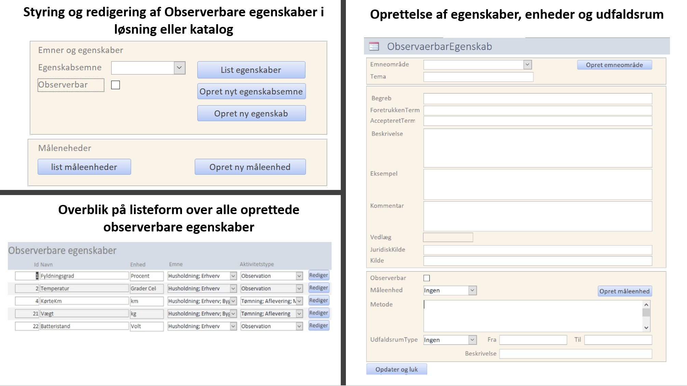

_Figur 31 - Eksempler fra prototypeløsning, hvor det er muligt at oprette og vedligeholde observerbare egenskaber, udfaldsrum og måleenheder. Herudover er det muligt at kategoriserer egenskaber efter oprettede emner._

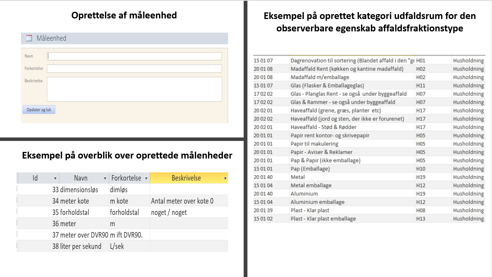

_Figur 32 - Eksempler fra prototypeløsning. Her er to konkrete eksempler på overblik over oprettede målenheder, og oprettede udfaldsrumstyper for den observerbare egenskab Affaldsfraktionstype. Denne egenskab handler om at kunne redegøre for typen af affald._

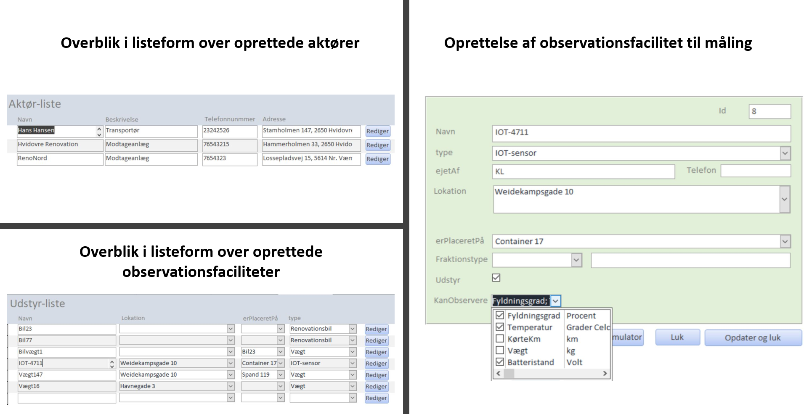

_Figur 33 - Eksempler fra prototypeløsning. Oprettelse og vedligeholdelse af oplysninger om udstyr og aktører. Samt muligheden for at angive hvilke observerbare egenskaber noget udstyr kan måle/observere_

## Infrastruktur

Infrastrukturperspektivet er en fast del af skabelonen for referencearkitekturer under FDA og skal beskrive de væsentligste forhold vedrørende den tekniske infrastruktur, der skal understøtte realisering af forretningsarkitekturen og applikationsarkitekturen beskrevet i referencearkitekturen.

Eftersom referencearkitekturen for observerbare og målbare data ikke direkte giver anvisninger på, hvordan datastandarderne(modellerne) implementeres som fysisk kode, vil det følgende være en kort beskrivelse af generelle anbefalinger i forhold til infrastrukturen for løsninger, der skal understøtte observation og målinger samt deling af relaterede data.

### Platform

Tekniske platform vil variere fra område til område. For løsninger med persondata skal man være særligt opmærksom på krav til databeskyttelse, herunder særligt krav til cloud-løsninger.

### Datalager

Hvis relevante målinger/datasæt skal stilles til rådighed for andre parter ved at løbende at overføre disse til delt/fælles datalager (repository), skal man være opmærksom på, om der på området er krav til opkobling på national infrastruktur (fx sundhedsområdet) eller international infrastruktur (fx klimaområdet).

### Serviceniveau (SLA)

Hvis der deles **resultatdata** (datasæt med observations- og måledata, dvs. konkrete forretnings- og transaktionsdata), **referencedata** (dvs. datamodeller, anvendelsesprofiler og (egenskabs)klassifikationer) eller **metadata** (om referencedata eller resultatdata), bør relevante (del)løsninger have en SLA der understøtter relevante parters behov.

Det kan derfor være relevant for et projekt at undersøge om sådanne behov og krav allerede er kortlagt og defineret, således at de kan genbruges. I modsat fald bør man sikre sig en afklaring med relevante nøgleinteressenter.

### Robusthed

Delte transaktionsdata skal naturligvis understøtte de konkrete forretningsbehov i forhold til robusthed særligt med henblik på tilgængelighed.

Når der anvendes delte referencedata via reference, skal disse kunne resolveres i realtid, hvilket kræver dels gode svar tider og høje oppetider.

### Fleksibilitet

Løsninger bør opbygges med løst koblede komponenter og med brug af komponenter som i sig selv understøtter en fleksibilitet i forhold til ændringer i fx lovgivning og forretningsbehov, understøttelse af anvendelse af fælles delte datamodeller og klassifikationer, eller i tekniske mulighed og behov.

Her skal man særlig være opmærksom på at identificere de delkomponenter, hvor fleksibilitet er vigtig, og sikre at der er de relevante rammer for at understøtte denne fleksibilitet. Det kan fx være i form af en god praksis for dokumentation og versionsstyring af den tekniske løsning og dens konfiguration.

### Skalerbarhed

Løsninger der skal understøtte datadeling i bred eller stor skala, skal naturligvis kunne understøtte dette. Derfor skal man særligt være opmærksom på om der er potentiale for udredt anvendelse og for stor variation i anvendelsen over tid, så fx kraftige udsving i anvendelsen er understøttet i alle relevante led i infrastrukturen.

### Sikkerhed

Løsninger, der skal kunne arbejde sammen på tværs af domæner, skal kunne understøtte føderation af data og brugerstyring på relevant niveau. Derfor skal man være opmærksom på, at løsningen dels skal overholde en fælles datamodel med relevante eksterne domæner, samt at den skal implementere relevante snitflader, kontroller og servicekrav i forhold til sikkerhed.

- - -

### Fodnoter

[\[1\]](#_ftnref1) [PROV-DM: The PROV Data Model (w3.org)](https://www.w3.org/TR/prov-dm/)

[\[2\]](#_ftnref2) [Semantic Sensor Network Ontology (w3.org)](https://www.w3.org/TR/vocab-ssn/#SOSAObservableProperty)

[\[3\]](#_ftnref3) [ISO - ISO 19156:2011 - Geographic information - Observations and measurements](https://www.iso.org/standard/32574.html)

[\[4\]](#_ftnref4) [Guidelines for the use of Observations & Measurements and Sensor Web Enablement-related standards in INSPIRE | INSPIRE (europa.eu)](https://inspire.ec.europa.eu/id/document/tg/d2.9-o%26m-swe)

[\[5\]](#_ftnref5) [INSPIRE Data Specification on Environmental Monitoring Facilities - Technical Guidelines | INSPIRE (europa.eu)](https://inspire.ec.europa.eu/id/document/tg/ef)

[\[6\]](#_ftnref6) [Dublin Core: DCMI metadata Terms](http://purl.org/dc/terms/Location)

[\[7\]](#_ftnref7) [PROV-O: The PROV Ontology (w3.org)](https://www.w3.org/TR/prov-o/)

[\[8\]](#_ftnref8)SNOMED CT (Systematized Nomenclature of Medicine Clinical Terms) er en global terminologi, der bruges til at beskrive kliniske begreber i sundhedssektoren, herunder også metodebeskrivelser af procedure, teknikker og undersøgelser som anvendes indenfor sundhedssektoren.

[\[9\]](#_ftnref9)[GeoDanmarkSpec6.0.1DK](http://www.geodanmark.nu/Spec6/HTML5/DK/601/StartHer.htm)

[\[10\]](#_ftnref10) Læs mere om Stancode: [Stancode (au.dk)](https://dce.au.dk/overvaagning/stancode/)

[\[11\]](#_ftnref11) Læs mere om KLE: [KL Emnesystematik (KLE)](https://www.kl.dk/okonomi-og-administration/digitalisering-og-teknologi/arbejdsgange-forretningsviden-og-informationshaandtering/kl-emnesystematik-kle/)

